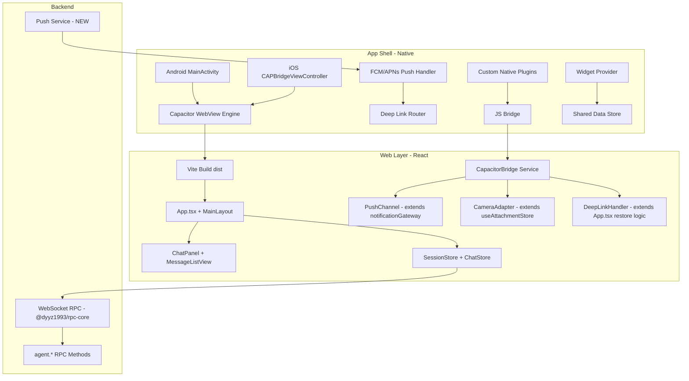
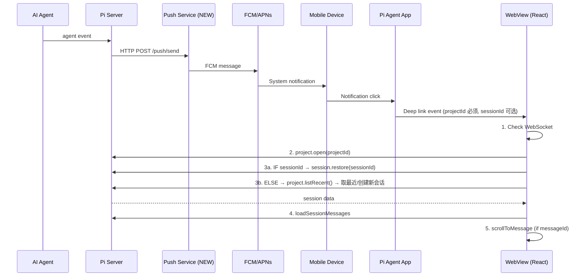
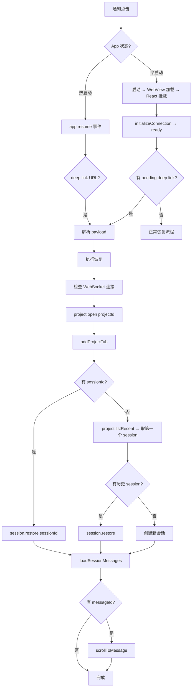
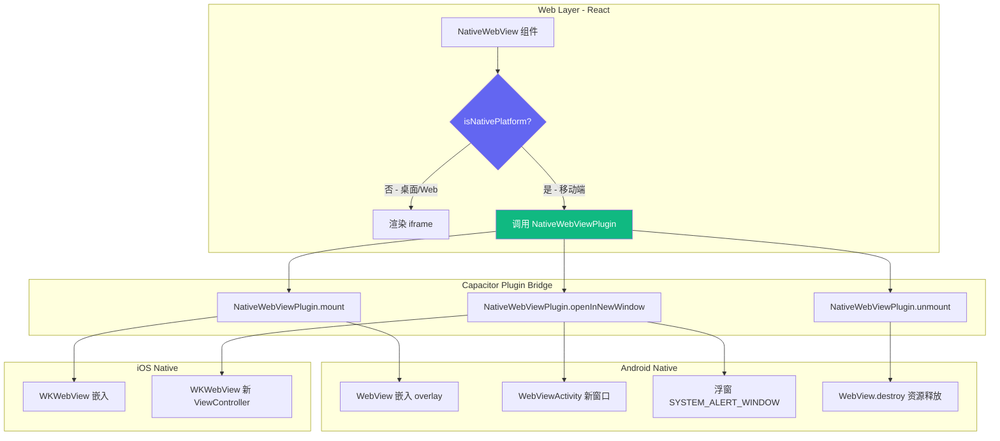

# Pi Agent Chat 移动端深度定制技术方案

## 1. 方案概述

### 1.1 设计哲学（不是重写，是增强）

本方案遵循 **"Web 优先，原生增强"** 的设计哲学。现有 Web 响应式布局已通过 breakpoint 系统（`src/mainview/layouts/MainLayout.tsx:59`）、drawer 模式、safe-area-inset 处理等机制实现了移动端基本可用。**不做任何页面级重写**，而是在现有 Web 代码基础上：

1. 用 **Capacitor** 包一层原生壳，让 WebView 获得原生 App 的分发渠道和系统能力
2. 通过 **Capacitor 插件** 注入原生能力（推送、相机、语音、Widget）
3. 在 Web 层做**定向修补**（已有代码的缺口修复），不改架构
4. 通过 **JS Bridge** 让 Web 层调用原生能力

### 1.2 核心原则

| 原则 | 说明 |
|------|------|
| Web 优先 | 所有 UI 逻辑保留在 React 层，原生层只提供系统能力 |
| 渐进增强 | 每个 P0/P1/P2 功能独立交付，不互相阻塞 |
| 最小侵入 | 修改现有文件时，只做必要的补丁，不重构 |
| 性能底线 | 大会话（>1000 条消息）首屏 < 2s，滚动帧率 ≥ 55fps |
| 向后兼容 | Capacitor 打包后的 WebView 仍可在浏览器中直接使用 |

### 1.3 技术选型：Capacitor

**选择 Capacitor 而非 React Native / Flutter / Tauri Mobile 的理由：**

- ✅ 现有 Vite + React 代码零修改即可在 WebView 中运行
- ✅ 插件生态成熟（Camera、Push、Filesystem、Haptics、Share）
- ✅ 支持自定义 NativePlugin（语音、Widget 需要自定义）
- ✅ 同时支持 Android (Gradle) 和 iOS (Xcode)
- ✅ 支持 Live Reload 开发模式（`npx cap run android --livereload`）

**不选其他方案的排除理由：**
- ❌ React Native / Flutter：需要完全重写 UI，违背"增强而非重写"原则
- ❌ Tauri Mobile：Android 支持不成熟，WebView 渲染有兼容问题
- ❌ PWA Only：无法实现推送通知、Widget、语音识别等原生能力

**依赖版本：**
```json
{
  "@capacitor/core": "^6.0.0",
  "@capacitor/cli": "^6.0.0",
  "@capacitor/android": "^6.0.0",
  "@capacitor/ios": "^6.0.0",
  "@capacitor/push-notifications": "^6.0.0",
  "@capacitor/camera": "^6.0.0",
  "@capacitor/filesystem": "^6.0.0",
  "@capacitor/haptics": "^6.0.0",
  "@capacitor/share": "^6.0.0",
  "@capacitor/deeplinks": "^6.0.0",
  "@capacitor/local-notifications": "^6.0.0"
}
```

### 1.4 整体架构图



### 1.5 与现有 Web 版的关系

```
现有项目结构不变：
├── src/mainview/          # Web 前端 (React) - 不改目录结构
├── src/server.ts          # Bun 后端 - 新增推送和分页 API
├── vite.config.ts         # 构建配置 - 新增 Capacitor target
├── android/               # 新增 - Capacitor Android 项目
├── ios/                   # 新增 - Capacitor iOS 项目
├── capacitor.config.ts    # 新增 - Capacitor 配置
└── src/mainview/lib/
    └── capacitor-bridge.ts  # 新增 - JS Bridge 封装层
```

**Web 代码变更范围（最小化）：**
- `src/mainview/App.tsx`：新增深链恢复逻辑（约 30 行）
- `src/mainview/components/chat/QuickActionToolbar.tsx`：补充 onClick handler（约 20 行）
- `src/mainview/components/chat/FileAttachment.tsx`：修复移动端删除按钮（约 10 行）
- `src/mainview/components/chat/InputBar.tsx`：添加 `enterKeyHint="send"` 和 composing 检测（约 15 行）
- `src/mainview/stores/use-chat-store.ts`：优化分页加载逻辑（约 50 行改动）
- `src/mainview/lib/channels/push-channel.ts`：新增推送通道文件
- `src/mainview/hooks/use-breakpoint.ts`：统一阈值为 640

---

## 2. Capacitor 集成方案

### 2.1 项目结构变更

```bash
android/                          # Capacitor Android 项目
├── app/src/main/
│   ├── java/com/piagent/chat/
│   │   ├── MainActivity.java           # Capacitor 入口
│   │   ├── VoiceChatPlugin.java        # 自定义：云 ASR 语音识别/TTS
│   │   ├── WidgetProvider.java         # 自定义：Android Widget
│   │   └── PushHandler.java            # FCM 推送处理
│   ├── res/
│   │   ├── xml/file_paths.xml          # FileProvider 配置
│   │   └── layout/widget_agent_status.xml
│   └── AndroidManifest.xml
├── capacitor-cordova-android-plugins/
└── variables.gradle

ios/                              # Capacitor iOS 项目
├── App/App/
│   ├── AppDelegate.swift              # 推送注册
│   ├── VoiceChatPlugin.swift           # 自定义：云 ASR 语音识别/TTS
│   └── Info.plist
├── App Widgets/                       # iOS Widget Extension
│   ├── AgentStatusWidget.swift
│   └── AgentStatusTimeline.swift
├── App.xcodeproj/
└── App.xcworkspace/

capacitor.config.ts               # Capacitor 配置
src/mainview/lib/
├── capacitor-bridge.ts           # JS Bridge 封装
├── channels/push-channel.ts      # 原生推送通道（新增）
└── native/
    ├── voice.ts                  # 云 ASR 语音插件接口
    ├── widget.ts                 # Widget 插件接口
    └── deep-link.ts              # 深链处理
```

### 2.2 初始化与配置

**`capacitor.config.ts`（项目根目录新建）：**

```typescript
import type { CapacitorConfig } from '@capacitor/cli';

const config: CapacitorConfig = {
  appId: 'com.piagent.chat',
  appName: 'Pi Agent Chat',
  webDir: 'dist',
  server: {
    androidScheme: 'https',
    url: process.env.CAP_LIVE_RELOAD_URL,
    cleartext: true,
  },
  plugins: {
    PushNotifications: {
      presentationOptions: ['badge', 'sound', 'alert'],
    },
    Camera: {
      presentationStyle: 'fullscreen',
    },
    DeepLinks: {
      scheme: 'piagentchat',
      host: 'app',
    },
    LocalNotifications: {
      smallIcon: 'ic_stat_icon',
      iconColor: '#6366F1',
      sound: 'default',
    },
  },
  android: {
    allowMixedContent: false,
    backgroundColor: '#0A0A0B',
  },
  ios: {
    backgroundColor: '#0A0A0B',
    contentInset: 'automatic',
  },
};

export default config;
```

**初始化命令序列：**

```bash
npm install @capacitor/core @capacitor/cli @capacitor/android @capacitor/ios
npm install @capacitor/push-notifications @capacitor/camera @capacitor/filesystem
npm install @capacitor/haptics @capacitor/share @capacitor/local-notifications
npx cap init "Pi Agent Chat" "com.piagent.chat" --web-dir dist
npm run build
npx cap add android
npx cap add ios
npx cap sync
```

### 2.3 Android 平台配置

**`android/app/src/main/AndroidManifest.xml` 关键配置：**

```xml
<manifest xmlns:android="http://schemas.android.com/apk/res/android">
    <uses-permission android:name="android.permission.POST_NOTIFICATIONS" />
    <uses-permission android:name="android.permission.CAMERA" />
    <uses-permission android:name="android.permission.RECORD_AUDIO" />
    <uses-permission android:name="android.permission.INTERNET" />
    <uses-permission android:name="android.permission.VIBRATE" />

    <application android:usesCleartextTraffic="true">
        <activity android:name=".MainActivity"
            android:launchMode="singleTask" android:exported="true"
            android:resizeableActivity="true"
            android:supportsPictureInPicture="true"
            android:configChanges="screenSize|smallestScreenSize|screenLayout|orientation">
            <!-- URL Scheme -->
            <intent-filter>
                <action android:name="android.intent.action.VIEW" />
                <category android:name="android.intent.category.DEFAULT" />
                <category android:name="android.intent.category.BROWSABLE" />
                <data android:scheme="piagentchat" />
            </intent-filter>
            <!-- App Links (HTTPS) -->
            <intent-filter android:autoVerify="true">
                <action android:name="android.intent.action.VIEW" />
                <category android:name="android.intent.category.DEFAULT" />
                <category android:name="android.intent.category.BROWSABLE" />
                <data android:host="app.piagent.chat" android:scheme="https" />
            </intent-filter>
            <!-- PiP 窗口尺寸配置 -->
            <layout
                android:defaultHeight="500dp"
                android:defaultWidth="400dp"
                android:gravity="top|end"
                android:minHeight="250dp"
                android:minWidth="250dp" />
        </activity>

        <service android:name=".PushHandler" android:exported="false">
            <intent-filter>
                <action android:name="com.google.firebase.MESSAGING_EVENT" />
            </intent-filter>
        </service>

        <receiver android:name=".WidgetProvider" android:exported="true">
            <intent-filter>
                <action android:name="android.appwidget.action.APPWIDGET_UPDATE" />
            </intent-filter>
            <meta-data android:name="android.appwidget.provider"
                android:resource="@xml/widget_info" />
        </receiver>
    </application>
</manifest>
```

**`android/app/build.gradle` 关键配置：**

```groovy
android {
    compileSdk 34
    defaultConfig {
        applicationId "com.piagent.chat"
        minSdk 26
        targetSdk 34
    }
}
dependencies {
    implementation platform('com.google.firebase:firebase-bom:33.0.0')
    implementation 'com.google.firebase:firebase-messaging'
    implementation 'androidx.work:work-runtime-ktx:2.9.0'
}
```

### 2.4 iOS 平台配置

**`ios/App/App/Info.plist` 关键权限声明：**

```xml
<key>NSCameraUsageDescription</key>
<string>Pi Agent 需要访问相机以拍照上传图片</string>
<key>NSMicrophoneUsageDescription</key>
<string>Pi Agent 需要访问麦克风以进行语音输入</string>
<key>NSPhotoLibraryUsageDescription</key>
<string>Pi Agent 需要访问相册以选择图片</string>
```

**`ios/App/App/AppDelegate.swift`：**

```swift
import UIKit
import Capacitor
import FirebaseCore
import FirebaseMessaging

@UIApplicationMain
class AppDelegate: UIResponder, UIApplicationDelegate {
    func application(_ application: UIApplication,
                     didFinishLaunchingWithOptions launchOptions: [UIApplication.LaunchOptionsKey: Any]?) -> Bool {
        FirebaseApp.configure()
        Messaging.messaging().delegate = self
        UNUserNotificationCenter.current().delegate = self
        UNUserNotificationCenter.current().requestAuthorization(options: [.alert, .badge, .sound]) { _, _ in }
        application.registerForRemoteNotifications()
        return true
    }

    func application(_ app: UIApplication, open url: URL,
                     options: [UIApplication.OpenURLOptionsKey: Any] = [:]) -> Bool {
        return ApplicationDelegateProxy.shared.application(app, open: url, options: options)
    }
}
```

### 2.5 WebView 性能调优

#### 硬件加速

**Android (`MainActivity.java`)：**
```java
public class MainActivity extends BridgeActivity {
    @Override
    protected void onCreate(Bundle savedInstanceState) {
        super.onCreate(savedInstanceState);
        getWindow().setFlags(
            WindowManager.LayoutParams.FLAG_HARDWARE_ACCELERATED,
            WindowManager.LayoutParams.FLAG_HARDWARE_ACCELERATED
        );
    }

    @Override
    protected void onNewIntent(Intent intent) {
        super.onNewIntent(intent);
        setIntent(intent);
    }
}
```

#### 缓存策略

**Android WebView 缓存配置（`MainActivity.java`）：**
```java
WebSettings settings = webView.getSettings();
settings.setCacheMode(WebSettings.LOAD_DEFAULT);
settings.setDomStorageEnabled(true);
settings.setDatabaseEnabled(true);
settings.setAppCacheEnabled(true);
settings.setAppCachePath(getCacheDir().getAbsolutePath());
settings.setAppCacheMaxSize(50 * 1024 * 1024);
```

#### 内存管理

**Android `onTrimMemory` 处理：**
```java
@Override
public void onTrimMemory(int level) {
    super.onTrimMemory(level);
    if (level >= TRIM_MEMORY_MODERATE) {
        getBridge().eval("window.__piAgentBridge?.onTrimMemory?.(" + level + ")");
    }
}
```

**Web 层内存释放（`src/mainview/lib/capacitor-bridge.ts`）：**
```typescript
window.__piAgentBridge = {
    onTrimMemory(level: number) {
        const store = useChatStore.getState();
        const sessions = Object.keys(store.messagesBySession);
        for (const sid of sessions) {
            if (sid !== useSessionStore.getState().activeSessionId) {
                store.clearSessionMessages(sid);
            }
        }
        useMermaidStore.getState().clearCache();
    },
};
```

### 2.6 原生桥接层设计（JS Bridge API）

**新建 `src/mainview/lib/capacitor-bridge.ts`：**

```typescript
import { Capacitor } from '@capacitor/core';
import { PushNotifications } from '@capacitor/push-notifications';
import { Camera, CameraResultType, CameraSource } from '@capacitor/camera';
import { Haptics, NotificationStyle } from '@capacitor/haptics';
import type { GatewayEvent } from './notification-gateway';

export const isNative = Capacitor.isNativePlatform();
export const platform = Capacitor.getPlatform();

// ===== 推送通知 =====
export async function registerPushNotifications(): Promise<string | null> {
    if (!isNative) return null;
    const permResult = await PushNotifications.requestPermissions();
    if (permResult.receive !== 'granted') return null;
    await PushNotifications.register();
    return new Promise((resolve) => {
        PushNotifications.addListener('registration', (token) => resolve(token.value));
        PushNotifications.addListener('registrationError', () => resolve(null));
    });
}

export function listenPushNotifications(
    onForeground: (event: GatewayEvent) => void
) {
    if (!isNative) return;
    PushNotifications.addListener('pushNotificationReceived', (notification) => {
        const event: GatewayEvent = {
            type: (notification.data?.type as GatewayEvent['type']) ?? 'agent_notify',
            sessionId: notification.data?.sessionId as string,
            title: notification.title ?? '',
            body: notification.body ?? '',
            level: 'info',
            data: notification.data as Record<string, unknown>,
        };
        onForeground(event);
    });

    PushNotifications.addListener('pushNotificationActionPerformed', (action) => {
        handleDeepLinkFromPayload(action.notification.data as Record<string, unknown>);
    });
}

// ===== 相机 =====
export async function takePhoto(): Promise<Blob | null> {
    if (!isNative) return null;
    try {
        const photo = await Camera.getPhoto({
            quality: 80,
            allowEditing: false,
            resultType: CameraResultType.Uri,
            source: CameraSource.Camera,
        });
        const response = await fetch(photo.webPath!);
        return await response.blob();
    } catch (err) {
        if ((err as any).message?.includes('User cancelled')) return null;
        throw err;
    }
}

export async function pickImages(): Promise<Blob[]> {
    if (!isNative) return [];
    try {
        const result = await Camera.pickImages({ quality: 80, limit: 5 });
        const blobs: Blob[] = [];
        for (const photo of result.photos) {
            const response = await fetch(photo.webPath!);
            blobs.push(await response.blob());
        }
        return blobs;
    } catch { return []; }
}

// ===== 震动反馈 =====
export async function hapticLight() {
    if (!isNative) return;
    await Haptics.impact({ style: NotificationStyle.Light });
}
export async function hapticSuccess() {
    if (!isNative) return;
    await Haptics.notification({ type: NotificationStyle.Success });
}

// ===== 深度链接 =====
export type DeepLinkPayload = {
    projectId?: string;
    projectPath?: string;
    sessionId?: string;
    messageId?: string;
    action?: string;
};

export function parseDeepLink(url: string): DeepLinkPayload | null {
    try {
        const u = new URL(url);
        if (u.protocol !== 'piagentchat:') return null;
        const parts = u.pathname.split('/').filter(Boolean);
        const payload: DeepLinkPayload = {};
        for (let i = 0; i < parts.length; i++) {
            if (parts[i] === 'project' && parts[i + 1]) {
                payload.projectId = decodeURIComponent(parts[i + 1]); i++;
            } else if (parts[i] === 'session' && parts[i + 1]) {
                payload.sessionId = decodeURIComponent(parts[i + 1]); i++;
            }
        }
        payload.messageId = u.searchParams.get('messageId') ?? undefined;
        payload.projectPath = u.searchParams.get('projectPath') ?? undefined;
        payload.action = u.searchParams.get('action') ?? undefined;
        return payload;
    } catch { return null; }
}

function handleDeepLinkFromPayload(data: Record<string, unknown>) {
    const payload: DeepLinkPayload = {
        projectId: (data.projectId ?? data.projectPath) as string,
        projectPath: data.projectPath as string,
        sessionId: data.sessionId as string | undefined,
        messageId: data.messageId as string,
        action: data.action as string,
    };
    if (!payload.projectId && !payload.projectPath) return;
    window.dispatchEvent(new CustomEvent('pi-agent-deeplink', { detail: payload }));
}

export function initDeepLinkListener() {
    if (!isNative) return;
    PushNotifications.addListener('pushNotificationActionPerformed', (action) => {
        handleDeepLinkFromPayload(action.notification.data as Record<string, unknown>);
    });
    import('@capacitor/app').then(({ App }) => {
        App.addListener('appUrlOpen', (event) => {
            const payload = parseDeepLink(event.url);
            if (payload) {
                window.dispatchEvent(new CustomEvent('pi-agent-deeplink', { detail: payload }));
            }
        });
    });
}

declare global {
    interface Window {
        __PI_AGENT_PLATFORM?: string;
        __PI_AGENT_NATIVE?: boolean;
        __piAgentBridge?: { onTrimMemory: (level: number) => void };
    }
}
```

### 2.7 构建与打包流程

**`package.json` 新增 scripts：**

```json
{
    "cap:sync": "npm run build && npx cap sync",
    "cap:android": "npm run cap:sync && npx cap open android",
    "cap:ios": "npm run cap:sync && npx cap open ios",
    "cap:run:android": "npm run build && npx cap run android",
    "cap:livereload:android": "npx cap run android --livereload --external",
    "cap:build:android:release": "npm run build && npx cap sync android && cd android && ./gradlew assembleRelease"
}
```

---

## 3. 历史会话性能优化（P0）

### 3.1 问题分析

#### 当前虚拟滚动的局限性

当前实现在 `src/mainview/components/chat/ChatPanel.tsx:153-167`：

```typescript
const mainVirtualizer = useVirtualizer({
    count: mainMessages.length,
    getScrollElement: () => messagesScrollRef.current,
    estimateSize: estimateMainSize,
    overscan: isMobileOrTablet ? 2 : 5,
    measureElement: (el) => el.getBoundingClientRect().height,
});
```

**问题清单：**

1. **全量加载**：`use-chat-store.ts:404` 调用 `agent.getFullMessages` 一次性拉取所有消息。当前 `PAGE_SIZE = 50`（第 157 行），但 `loadMoreMessages`（第 539 行）再次调用 `agent.getFullMessages` 获取全量数据再做前端切片——**后端没有真正的分页 API**

2. **内存占用**：`messagesBySession: Record<string, ChatMessage[]>` 存储所有消息的完整对象。500 条消息的 session 约 2.5MB，10 个 session = 25MB

3. **渲染瓶颈**：`estimateMessageSize`（ChatPanel.tsx:44-63）只是粗略估算，但 `measureElement` 会强制 reflow

4. **消息数据映射开销**：`normalizeToolBlocks`（use-chat-store.ts:15-155）有 O(n²) 复杂度的匹配操作

#### 消息数据结构分析

`ChatMessage`（`src/mainview/types/index.ts:84-96`）中 `ContentBlock`（第 49-73 行）最重的部分：
- `toolExecution.output`：可能包含整个文件内容
- `toolExecution.args`：包含工具参数 JSON（可能很大）

**内存占用估算（单个 session）：**

| 场景 | 消息数 | 平均大小 | 总内存 | 当前表现 |
|------|--------|----------|--------|----------|
| 轻度使用 | 50 | 3KB | 150KB | ✅ 流畅 |
| 日常使用 | 200 | 5KB | 1MB | ⚠️ 可感知延迟 |
| 重度使用 | 500 | 5KB | 2.5MB | ❌ 首屏 > 3s |
| 大型项目 | 1000+ | 5KB | 5MB+ | ❌ OOM / 卡死 |

### 3.2 分页加载策略

#### 首屏加载（只加载最近 N 条消息）

**当前问题**：`use-chat-store.ts:507-508` 前端切片但后端返回全量：

```typescript
const hasMore = msgs.length > PAGE_SIZE;
const displayMsgs = hasMore ? msgs.slice(-PAGE_SIZE) : msgs;
```

**改进方案：后端增加分页 API**

新增 RPC 方法定义（在 `src/shared/modules/agent.ts` 或 `src/shared/rpc-schema.ts` 中）：

```typescript
"agent.getMessagesPage": {
    params: {
        sessionId: string;
        sessionPath?: string;
        cursor?: string;           // 消息 ID，null 表示从最新开始
        direction: "before" | "after";
        limit: number;             // 默认 50
        lightweight?: boolean;     // 轻量模式，省略 tool output
    };
    result: {
        messages: Array<Record<string, unknown>>;
        customEntries?: CustomEntryForUI[];
        hasMore: boolean;
        total: number;
    };
};

"agent.getMessageContent": {
    params: {
        sessionId: string;
        messageId: string;
        blockIndex?: number;
    };
    result: {
        blocks: ContentBlock[];
    };
};
```

**前端 `loadSessionMessages` 改造（`src/mainview/stores/use-chat-store.ts`）：**

```typescript
// 新增 state 字段
_pageCursorBySession: Record<string, string | undefined>;

// 改造 loadSessionMessages（第 369-537 行）
loadSessionMessages: async (sessionId, options) => {
    // ... guard 逻辑保持不变 ...

    // 改用分页 API：只请求最近 PAGE_SIZE 条
    const result = await apiClient.call("agent.getMessagesPage", {
        sessionId: sid,
        direction: "before",
        limit: PAGE_SIZE,
        lightweight: true,       // 轻量模式
    });

    // 消息映射逻辑保持不变（messageToChatMessage + normalizeToolBlocks）
    const msgs: ChatMessage[] = /* ... */;

    set((s) => ({
        messagesBySession: { ...s.messagesBySession, [sid]: msgs },
        historyLoadVersion: s.historyLoadVersion + 1,
        hasMoreMessagesBySession: { ...s.hasMoreMessagesBySession, [sid]: result.hasMore },
        _pageCursorBySession: {
            ...s._pageCursorBySession,
            [sid]: msgs.length > 0 ? msgs[0].id : undefined,
        },
    }));
},
```

**前端 `loadMoreMessages` 改造（`src/mainview/stores/use-chat-store.ts:539-634`）：**

```typescript
loadMoreMessages: async (sessionId) => {
    const sid = sessionId;
    if (!sid) return;
    const hasMore = get().hasMoreMessagesBySession[sid];
    if (!hasMore || get().isLoadingMoreBySession[sid]) return;

    set((s) => ({
        isLoadingMoreBySession: { ...s.isLoadingMoreBySession, [sid]: true },
    }));

    try {
        const cursor = get()._pageCursorBySession?.[sid];
        const result = await apiClient.call("agent.getMessagesPage", {
            sessionId: sid,
            direction: "before",
            cursor,
            limit: PAGE_SIZE,
            lightweight: true,
        });

        const olderMsgs: ChatMessage[] = /* messageToChatMessage + normalizeToolBlocks */;

        const currentMsgs = get().messagesBySession[sid] || [];
        const prepended = [...olderMsgs, ...currentMsgs];

        set((s) => ({
            messagesBySession: { ...s.messagesBySession, [sid]: prepended },
            hasMoreMessagesBySession: {
                ...s.hasMoreMessagesBySession, [sid]: result.hasMore,
            },
            _pageCursorBySession: {
                ...s._pageCursorBySession,
                [sid]: olderMsgs.length > 0 ? olderMsgs[0].id : cursor,
            },
        }));
    } catch (err) {
        log.error("loadMoreMessages failed", { error: err });
    } finally {
        set((s) => ({
            isLoadingMoreBySession: { ...s.isLoadingMoreBySession, [sid]: false },
        }));
    }
},
```

**加载状态 UI**（已在 `MessageListView.tsx:127-135` 实现，无需改动）。

**触发时机**（已在 `ChatPanel.tsx:328-339` 实现，无需改动）。

### 3.3 虚拟滚动优化

#### 超大消息的懒渲染

**方案：对超大内容进行截断 + 懒展开**

在 `MessageCard` 组件中，对超过 `MAX_COLLAPSED_CHARS = 3000` 字符的 text block 或 tool output 自动折叠。已有的 `useTurnStore.collapsedMessageIdsBySession` 可复用。

#### Markdown/代码块按需渲染

**方案：IntersectionObserver 驱动的懒渲染**

新增 `src/mainview/hooks/use-lazy-render.ts`：

```typescript
import { useEffect, useRef, useState } from "react";

export function useLazyRender(threshold = 200): {
    ref: React.RefObject<HTMLDivElement>;
    shouldRender: boolean;
} {
    const ref = useRef<HTMLDivElement>(null);
    const [shouldRender, setShouldRender] = useState(false);

    useEffect(() => {
        const el = ref.current;
        if (!el) return;
        const observer = new IntersectionObserver(
            ([entry]) => {
                if (entry.isIntersecting) {
                    setShouldRender(true);
                    observer.disconnect();
                }
            },
            { rootMargin: `${threshold}px` }
        );
        observer.observe(el);
        return () => observer.disconnect();
    }, [threshold]);

    return { ref, shouldRender };
}
```

在 `MessageCard` 中对 Markdown 渲染、代码高亮、Mermaid 图表使用此 hook。

#### 动态 item size 缓存

**改进 `ChatPanel.tsx` 中的 virtualizer 配置**：

```typescript
const sizeCache = useRef<Map<string, number>>(new Map());

const mainVirtualizer = useVirtualizer({
    count: mainMessages.length,
    getScrollElement: () => messagesScrollRef.current,
    estimateSize: useCallback((index: number) => {
        const msg = mainMessages[index];
        return sizeCache.current.get(msg.id) ?? estimateMessageSize(msg);
    }, [mainMessages]),
    overscan: isMobileOrTablet ? 2 : 5,
    measureElement: (el) => {
        const height = el.getBoundingClientRect().height;
        const msgId = el.getAttribute('data-msg-id');
        if (msgId) sizeCache.current.set(msgId, height);
        return height;
    },
});
```

### 3.4 消息数据瘦身

#### 轻量消息模型

```typescript
// src/mainview/types/index.ts 新增
export type LightweightContentBlock =
    | { type: "text"; text: string; truncated?: boolean }
    | { type: "toolExecution"; toolCallId: string; toolName: string; status: ToolExecutionStatus }
    | { type: "thinking" }
    | { type: "custom"; customType: string }
    | { type: "compactionSummary" }
    | { type: "uiInteraction"; id: string; method: UIMethod; status: UIInteractionStatus };
```

关键差异：`toolExecution` 不含 `args`、`output`、`details`（只在用户展开时按需加载）。

#### 工具调用详情按需加载

当用户展开折叠的 tool execution 时，调用 `agent.getMessageContent` 获取完整输出：

```typescript
// 在 MessageCard 或 BashRenderer 中
async function loadFullContent(messageId: string, blockIndex: number) {
    const result = await apiClient.call("agent.getMessageContent", {
        sessionId: useSessionStore.getState().activeSessionId!,
        messageId,
        blockIndex,
    });
    // 更新对应消息的 content block
}
```

### 3.5 内存管理

#### 不可见消息的 DOM 回收

`@tanstack/react-virtual` 默认卸载不可见区域 DOM。需审计：
- `MermaidBlock`：确保 `mermaid.render` 的 DOM 在 unmount 时清理
- `CachedReactMarkdown`：确认缓存不会无限增长

#### 大 session 的分段管理

新增 LRU 清理策略，同一时间最多保持 3 个 session 的消息在内存中：

```typescript
// use-chat-store.ts 新增
const MAX_ACTIVE_SESSIONS = 3;

function evictOldestSessions(currentSessionId: string) {
    const { messagesBySession } = get();
    const sessionIds = Object.keys(messagesBySession);
    if (sessionIds.length <= MAX_ACTIVE_SESSIONS) return;
    const otherSessions = sessionIds.filter(id => id !== currentSessionId);
    for (const sid of otherSessions.slice(0, otherSessions.length - MAX_ACTIVE_SESSIONS + 1)) {
        get().clearSessionMessages(sid);
    }
}
```

### 3.6 后端配合改造

#### 服务端消息分页 API

在 `src/shared/handlers/agent.ts` 中新增 `agent.getMessagesPage` handler：

```typescript
async function handleGetMessagesPage(params: {
    sessionId: string;
    cursor?: string;
    direction: "before" | "after";
    limit: number;
    lightweight?: boolean;
}) {
    const session = getSession(params.sessionId);
    let messages = session.getMessages();

    if (params.cursor) {
        const cursorIdx = messages.findIndex(m => m.id === params.cursor);
        if (cursorIdx >= 0) {
            messages = params.direction === "before"
                ? messages.slice(Math.max(0, cursorIdx - params.limit), cursorIdx)
                : messages.slice(cursorIdx + 1, cursorIdx + 1 + params.limit);
        }
    } else {
        messages = messages.slice(-params.limit);
    }

    // 轻量模式：截断大内容
    if (params.lightweight) {
        messages = messages.map(m => truncateMessage(m, 1000));
    }

    return {
        messages,
        hasMore: messages.length >= params.limit,
        total: session.getMessageCount(),
    };
}
```

### 3.7 性能指标与监控

| 指标 | 目标值 | 测量方法 |
|------|--------|----------|
| 首屏加载（200条） | < 1.5s | `performance.mark` + `performance.measure` |
| 首屏加载（1000条） | < 2.5s | 同上 |
| 滚动帧率 | ≥ 55fps | Chrome DevTools Performance |
| 内存占用（单个活跃session） | < 10MB | Chrome DevTools Memory |
| 向上翻页加载延迟 | < 500ms | `loadMoreMessages` 计时 |

**埋点方案（在 `use-chat-store.ts` 中添加）：**

```typescript
const perfMark = `session-load-${sessionId}`;
performance.mark(`${perfMark}-start`);
// ... 加载逻辑 ...
performance.mark(`${perfMark}-end`);
performance.measure(perfMark, `${perfMark}-start`, `${perfMark}-end`);
```

---

## 4. 消息推送通知与深度链接（P0）

### 4.1 整体架构



### 4.2 服务端推送改造

#### FCM / APNs 集成

**新增 `src/gateway/push-service.ts`：**

```typescript
interface PushMessage {
    userId: string;
    fcmToken: string;
    event: {
        type: 'session_complete' | 'session_error' | 'permission_request' | 'agent_notify';
        sessionId?: string;
        projectId: string;
        projectPath?: string;
        title: string;
        body: string;
        messageId?: string;
    };
}

class PushService {
    private fcmTokens: Map<string, string> = new Map();

    async registerToken(userId: string, token: string, platform: 'android' | 'ios') {
        this.fcmTokens.set(`${userId}:${platform}`, token);
    }

    async send(push: PushMessage) {
        const payload = {
            token: push.fcmToken,
            notification: { title: push.event.title, body: push.event.body },
            data: {
                type: push.event.type,
                projectId: push.event.projectId,
                sessionId: push.event.sessionId ?? '',
                projectPath: push.event.projectPath ?? '',
                messageId: push.event.messageId ?? '',
                action: 'open_project',
            },
            android: {
                priority: 'high' as const,
                notification: {
                    channelId: 'pi-agent-events',
                    icon: 'ic_stat_icon',
                    color: '#6366F1',
                },
            },
            apns: {
                payload: {
                    aps: { sound: 'default', badge: 1, 'mutable-content': 1 },
                },
            },
        };
        await admin.messaging().send(payload);
    }
}
```

#### 推送事件类型映射

基于现有 `notification-gateway.ts:1-8` 的 `GatewayEventType`：

| GatewayEventType | 推送? | 深链 action |
|---|---|---|
| `session_complete` | ✅ | `open_session` |
| `session_error` | ✅ | `open_session` |
| `permission_request` | ✅ 高优先级 | `reply_permission` |
| `agent_notify` | ✅ | `open_session` |
| `retry_start` / `retry_success` | ❌ in-app only | - |
| `retry_failed` | ✅ | `open_session` |

### 4.3 客户端推送接收

**新建 `src/mainview/lib/channels/push-channel.ts`：**

```typescript
import { notificationGateway, type GatewayEvent } from "../notification-gateway";
import { isNative, registerPushNotifications, listenPushNotifications } from "../capacitor-bridge";
import { apiClient } from "../api-client";
import { Capacitor } from '@capacitor/core';

let pushInitialized = false;

export async function initNativePush() {
    if (!isNative || pushInitialized) return;
    pushInitialized = true;

    const token = await registerPushNotifications();
    if (!token) return;

    await apiClient.call("push.registerToken" as never, {
        token, platform: Capacitor.getPlatform(),
    } as never);

    listenPushNotifications((event) => {
        notificationGateway.emit(event);
    });
}
```

**在 `src/mainview/main.tsx` 中初始化：**

```typescript
import { initNativePush } from "./lib/channels/push-channel";
if (Capacitor.isNativePlatform()) {
    initNativePush().catch(console.error);
}
```

### 4.4 深度链接方案（核心）

#### 深链 URL Scheme 设计（三级结构）

```
Level 1: piagentchat://
         → 打开 App 首页

Level 2: piagentchat://project/{projectId}
         → 打开指定项目，自动恢复该项目的最近会话（或新建会话）

Level 3: piagentchat://project/{projectId}/session/{sessionId}
         → 可选，仅在明确知道会话ID时使用，恢复指定会话

HTTPS App Links:
https://app.piagent.chat/project/{projectId}
https://app.piagent.chat/project/{projectId}/session/{sessionId}
```

**关键设计决策：sessionId 为可选参数**
- 没有 sessionId 时，恢复逻辑为：加载项目 → 查询最近会话 → 如有则恢复，没有则创建新会话
- 后端推送只需要知道 `projectId`，不需要强制传 `sessionId`

#### 恢复流程（冷启动 + 热启动）



#### 在 `src/mainview/App.tsx` 中新增深链恢复逻辑

```typescript
import { initDeepLinkListener, type DeepLinkPayload, isNative } from "./lib/capacitor-bridge";

const pendingDeepLinkRef = useRef<DeepLinkPayload | null>(null);

useEffect(() => {
    if (!isNative) return;
    initDeepLinkListener();

    const handler = (e: Event) => {
        const payload = (e as CustomEvent<DeepLinkPayload>).detail;
        if (!payload.projectId && !payload.projectPath) return;
        const currentReady = useAppStore.getState().ready;
        if (!currentReady) {
            pendingDeepLinkRef.current = payload;
        } else {
            executeDeepLinkRecovery(payload);
        }
    };

    window.addEventListener('pi-agent-deeplink', handler);
    return () => window.removeEventListener('pi-agent-deeplink', handler);
}, []);

useEffect(() => {
    if (ready && pendingDeepLinkRef.current) {
        const payload = pendingDeepLinkRef.current;
        pendingDeepLinkRef.current = null;
        executeDeepLinkRecovery(payload);
    }
}, [ready]);

async function executeDeepLinkRecovery(payload: DeepLinkPayload) {
    const { projectId, projectPath, sessionId, messageId } = payload;
    const targetProjectId = projectId ?? projectPath;
    if (!targetProjectId) return;
    try {
        const tabId = `proj-${targetProjectId.replace(/\//g, "-")}`;
        const projectName = targetProjectId.split("/").filter(Boolean).pop() ?? targetProjectId;

        // Step 1: 打开项目
        await apiClient.call("project.open", { path: targetProjectId });
        addProjectTab({ id: tabId, name: projectName, path: targetProjectId });
        useSessionStore.getState().setActiveProject(tabId);

        // Step 2: 加载会话
        await loadSessionsForProject(targetProjectId);

        let targetSessionId = sessionId;

        if (targetSessionId) {
            // 有 sessionId → 直接恢复指定会话
            await apiClient.call("agent.start", {
                sessionId: targetSessionId, projectPath: targetProjectId,
            });
            useSessionStore.getState().setActiveSession(targetSessionId, true);
        } else {
            // 没有 sessionId → 查找最近会话或创建新会话
            const sessions = useSessionStore.getState().sessionsByProject?.[tabId] ?? [];
            if (sessions.length > 0) {
                targetSessionId = sessions[0].id;
                await apiClient.call("agent.start", {
                    sessionId: targetSessionId, projectPath: targetProjectId,
                    sessionPath: sessions[0].path,
                });
                useSessionStore.getState().setActiveSession(targetSessionId, true);
            } else {
                // 没有历史会话 → 自动创建新会话
                const newSession = await apiClient.call("agent.start", {
                    projectPath: targetProjectId,
                });
                targetSessionId = newSession.sessionId;
                useSessionStore.getState().setActiveSession(targetSessionId, true);
            }
        }

        // Step 3: 加载消息
        useChatStore.getState().loadSessionMessages(targetSessionId!, {
            force: true,
        });

        // Step 4: 滚动到消息
        if (messageId) {
            setTimeout(() => {
                const el = document.querySelector(`[data-msg-id="${messageId}"]`);
                if (el) {
                    el.scrollIntoView({ behavior: 'smooth', block: 'center' });
                    el.classList.add('highlight-flash');
                    setTimeout(() => el.classList.remove('highlight-flash'), 2000);
                }
            }, 1000);
        }
    } catch (err) {
        addLog(`Deep link recovery failed: ${err instanceof Error ? err.message : String(err)}`);
    }
}
```

#### Universal Links (iOS) / App Links (Android)

**iOS `apple-app-site-association`**（放在 `https://app.piagent.chat/.well-known/`）：
```json
{
    "applinks": {
        "details": [{
            "appIDs": ["TEAMID.com.piagent.chat"],
            "components": [
                { "/": "/project/*" },
                { "/": "/project/*/session/*" }
            ]
        }]
    }
}
```

**Android `assetlinks.json`**（放在 `https://app.piagent.chat/.well-known/`）：
```json
[{
    "relation": ["delegate_permission/common.handle_all_urls"],
    "target": {
        "namespace": "android_app",
        "package_name": "com.piagent.chat",
        "sha256_cert_fingerprints": ["SHA256_FINGERPRINT"]
    }
}]
```

### 4.5 通知权限管理

**策略**：不在首次启动就请求，而在用户第一次发送消息后延迟 3 秒请求。

```typescript
let permissionRequested = false;

export async function requestPushPermissionIfNeeded() {
    if (!isNative || permissionRequested) return;
    permissionRequested = true;
    setTimeout(async () => {
        const token = await registerPushNotifications();
        if (token) {
            await apiClient.call("push.registerToken" as never, {
                token, platform: Capacitor.getPlatform(),
            } as never);
        }
    }, 3000);
}
```

触发点：在 `use-chat-store.ts` 的 `sendMessage` 成功后调用 `requestPushPermissionIfNeeded()`。

---

## 5. 语音对话模式（P1）

### 5.1 方案选型对比

使用国内云服务商的实时语音识别（ASR）服务，替代系统原生 SpeechRecognizer：

| 服务商 | 产品 | 实时ASR | 实时翻译 | WebSocket流式 | 中文支持 | 价格 |
|--------|------|---------|---------|--------------|---------|------|
| 阿里云 | 智能语音交互 (Paraformer) | ✅ 一句话/实时/录音文件 | ✅ 中英互译 | ✅ | ⭐⭐⭐⭐⭐ | 免费额度+按量 |
| 火山引擎 | 语音识别 (流式/一句话) | ✅ | ✅ 多语言翻译 | ✅ | ⭐⭐⭐⭐⭐ | 免费额度+按量 |
| 字节豆包 | Doubao Speech | ✅ 实时语音识别 | ✅ | ✅ | ⭐⭐⭐⭐⭐ | API 调用计费 |
| 腾讯云 | 语音识别 (ASR) | ✅ 实时流式 | ✅ 语种识别 | ✅ | ⭐⭐⭐⭐⭐ | 免费额度+按量 |
| 讯飞 | 语音转写/听写 | ✅ | ✅ 多语种 | ✅ | ⭐⭐⭐⭐⭐ | 按量计费 |

### 5.2 推荐方案：阿里云 Paraformer（实时版）

**选择理由：**
- 中文识别率业界领先（基于 FunASR 开源模型）
- 支持 WebSocket 流式输入，延迟 < 200ms
- 支持实时翻译（中英互译、多语种）
- 有免费额度（每月一定时长免费）
- SDK 完善（Android/iOS/JavaScript）

### 5.3 技术架构

语音交互采用**三层架构**：

```
┌─────────────────────────────────┐
│     App 层 (React / Capacitor)   │
│  VoiceButton UI + 状态管理       │
└──────────┬──────────────────────┘
           │ Capacitor Plugin Bridge
┌──────────▼──────────────────────┐
│   Native Plugin (Android/iOS)   │
│  - 音频采集 (16kHz PCM)          │
│  - 音频播放 (TTS)               │
│  - WebSocket 客户端             │
└──────────┬──────────────────────┘
           │ WebSocket (TLS)
┌──────────▼──────────────────────┐
│   云服务 ASR (阿里云/火山等)      │
│  - 实时语音识别 (STT)            │
│  - 实时翻译 (可选)               │
│  - 返回识别结果 (中间+最终)      │
└─────────────────────────────────┘

AI 回复 → 服务端调用 TTS 云服务 → 返回音频流 → Native Plugin 播放
```

### 5.4 Capacitor 自定义插件设计

插件名：`VoiceChatPlugin`

```typescript
// 插件 API 设计
interface VoiceChatPlugin {
  // 开始录音+实时识别
  startRecognition(options: {
    provider: 'aliyun' | 'volcengine' | 'doubao';
    language: 'zh' | 'en' | 'auto';
    translateTo?: string;
    appId: string;
    token: string;
  }): Promise<void>;

  // 停止录音
  stopRecognition(): Promise<void>;

  // 监听实时识别结果
  onPartialResult(callback: (text: string) => void): void;
  onFinalResult(callback: (text: string, translation?: string) => void): void;

  // TTS 播放
  speak(options: {
    text: string;
    provider: 'aliyun' | 'volcengine';
    voice?: string;
  }): Promise<void>;

  // 停止播放
  stopSpeaking(): Promise<void>;

  // 播放状态
  onSpeakComplete(callback: () => void): void;
}
```

### 5.5 Android 实现要点

使用阿里云 Java SDK：

**`android/app/src/main/java/com/piagent/chat/VoiceChatPlugin.java`：**

```java
@CapacitorPlugin(
    name = "VoiceChat",
    permissions = [Permission(strings = [Manifest.permission.RECORD_AUDIO], alias = "mic")]
)
public class VoiceChatPlugin extends Plugin {
    private NlsClient nlsClient;
    private AudioRecord audioRecord;
    private boolean isRecording = false;

    // 音频参数：16kHz, 16bit, mono
    private static final int SAMPLE_RATE = 16000;
    private static final int CHANNEL_CONFIG = AudioFormat.CHANNEL_IN_MONO;
    private static final int AUDIO_FORMAT = AudioFormat.ENCODING_PCM_16BIT;

    @PluginMethod
    public void startRecognition(PluginCall call) {
        String provider = call.getString("provider", "aliyun");
        String language = call.getString("language", "zh");
        String appId = call.getString("appId");
        String token = call.getString("token");

        // 初始化阿里云 NLS 客户端
        nlsClient = new NlsClient();

        // 创建识别请求
        SpeechRecognizer recognizer = new SpeechRecognizer();
        recognizer.setAppKey(appId);
        recognizer.setToken(token);
        recognizer.setFormat("pcm");
        recognizer.setSampleRate(SAMPLE_RATE);
        recognizer.setEnableIntermediateResult(true);

        recognizer.setRecognizerListener(new SpeechRecognizerListener() {
            @Override
            public void onRecognitionResultChanged(String text) {
                notifyListeners("voice:partial", new JSObject().put("text", text));
            }

            @Override
            public void onRecognitionCompleted(String text) {
                notifyListeners("voice:result", new JSObject().put("text", text).put("isFinal", true));
            }

            @Override
            public void onError(String error) {
                notifyListeners("voice:error", new JSObject().put("code", error));
            }
        });

        // 开始音频采集
        int bufferSize = AudioRecord.getMinBufferSize(SAMPLE_RATE, CHANNEL_CONFIG, AUDIO_FORMAT);
        audioRecord = new AudioRecord(MediaRecorder.AudioSource.MIC, SAMPLE_RATE, CHANNEL_CONFIG, AUDIO_FORMAT, bufferSize);
        audioRecord.startRecording();
        isRecording = true;

        // 音频流发送线程
        new Thread(() -> {
            byte[] buffer = new byte[bufferSize];
            while (isRecording) {
                int read = audioRecord.read(buffer, 0, buffer.length);
                if (read > 0) {
                    recognizer.sendAudio(buffer, 0, read);
                }
            }
        }).start();

        call.resolve();
    }

    @PluginMethod
    public void stopRecognition(PluginCall call) {
        isRecording = false;
        if (audioRecord != null) {
            audioRecord.stop();
            audioRecord.release();
            audioRecord = null;
        }
        call.resolve();
    }
}
```

### 5.6 iOS 实现要点

使用阿里云 iOS SDK 或直接 WebSocket：

**`ios/App/App/VoiceChatPlugin.swift`：**

```swift
@objc(VoiceChatPlugin)
class VoiceChatPlugin: CAPPlugin {
    private let audioEngine = AVAudioEngine()
    private var webSocketTask: URLSessionWebSocketTask?
    private var isRecording = false

    @objc func startRecognition(_ call: CAPPluginCall) {
        let provider = call.getString("provider") ?? "aliyun"
        let appId = call.getString("appId") ?? ""
        let token = call.getString("token") ?? ""
        let language = call.getString("language") ?? "zh"

        // 构建阿里云 ASR WebSocket URL
        let wsUrl = "wss://nls-gateway-cn-shanghai.aliyuncs.com/ws/v1?token=\(token)"

        guard let url = URL(string: wsUrl) else {
            call.reject("Invalid WebSocket URL"); return
        }

        let session = URLSession(configuration: .default)
        webSocketTask = session.webSocketTask(with: url)
        webSocketTask?.resume()

        // 发送起始配置
        let startMessage: [String: Any] = [
            "header": ["appkey": appId, "message_id": UUID().uuidString],
            "payload": ["format": "pcm", "sample_rate": 16000, "enable_intermediate_result": true],
            "context": ["sdk": ["name": "ios", "version": "1.0"]]
        ]
        // ... 发送 JSON 配置到 WebSocket ...

        // 音频采集：AVAudioEngine
        let inputNode = audioEngine.inputNode
        let format = inputNode.outputFormat(forBus: 0)
        let asrFormat = AVAudioFormat(commonFormat: .pcmFormatInt16, sampleRate: 16000, channels: 1, interleaved: true)!

        let converter = AVAudioConverter(from: format, to: asrFormat)!

        inputNode.installTap(onBus: 0, bufferSize: 1024, format: format) { [weak self] buffer, _ in
            guard self?.isRecording == true else { return }
            // 转换为 16kHz PCM 并通过 WebSocket 发送
            // ... PCM 数据发送到阿里云 ASR ...
        }

        audioEngine.prepare()
        try? audioEngine.start()
        isRecording = true

        // 接收识别结果
        receiveRecognitionResults()

        call.resolve()
    }

    private func receiveRecognitionResults() {
        webSocketTask?.receive { [weak self] result in
            switch result {
            case .success(let message):
                switch message {
                case .string(let text):
                    // 解析阿里云返回的 JSON，提取识别文本
                    if let data = text.data(using: .utf8),
                       let json = try? JSONSerialization.jsonObject(with: data) as? [String: Any],
                       let payload = json["payload"] as? [String: Any],
                       let result = payload["result"] as? String {
                        let isFinal = (payload["status"] as? Int) == 2
                        self?.notifyListeners("voice:\(isFinal ? "result" : "partial")",
                            data: ["text": result, "isFinal": isFinal])
                    }
                default: break
                }
                self?.receiveRecognitionResults() // 继续接收
            case .failure: break
            }
        }
    }

    @objc func stopRecognition(_ call: CAPPluginCall) {
        isRecording = false
        audioEngine.stop()
        webSocketTask?.cancel(with: .normalClosure, reason: nil)
        call.resolve()
    }

    // TTS 播放：使用系统自带或阿里云 CosyVoice
    @objc func speak(_ call: CAPPluginCall) {
        guard let text = call.getString("text") else { call.reject("text required"); return }
        let utterance = AVSpeechUtterance(string: text)
        utterance.language = "zh-CN"
        let synthesizer = AVSpeechSynthesizer()
        synthesizer.speak(utterance)
        call.resolve()
    }

    @objc func stopSpeaking(_ call: CAPPluginCall) {
        // ... stop TTS ...
        call.resolve()
    }
}
```

### 5.7 前端集成

**新建 `src/mainview/components/chat/VoiceButton.tsx`：**

```tsx
import { useState, useCallback, useEffect } from "react";
import { Mic, MicOff } from "lucide-react";
import { registerPlugin } from '@capacitor/core';
import { hapticMedium, isNative } from "../../lib/capacitor-bridge";
import { useChatStore } from "../../stores/use-chat-store";

interface VoiceChatPlugin {
    startRecognition(options: {
        provider: 'aliyun' | 'volcengine' | 'doubao';
        language: 'zh' | 'en' | 'auto';
        translateTo?: string;
        appId: string;
        token: string;
    }): Promise<void>;
    stopRecognition(): Promise<void>;
    speak(options: { text: string; provider: string; voice?: string }): Promise<void>;
    stopSpeaking(): Promise<void>;
    addListener(eventName: string, listener: (data: any) => void): Promise<any>;
}

const VoiceChat = registerPlugin<VoiceChatPlugin>('VoiceChat');

// ASR 配置（从环境变量或配置服务获取）
const ASR_CONFIG = {
    provider: 'aliyun' as const,
    language: 'auto' as const,
    translateTo: 'zh',
    appId: import.meta.env.VITE_ASR_APP_ID ?? '',
    token: import.meta.env.VITE_ASR_TOKEN ?? '',
};

export function VoiceButton() {
    const [isRecording, setIsRecording] = useState(false);
    const [partialText, setPartialText] = useState("");

    const startRecording = useCallback(async () => {
        if (!isNative) return;
        try {
            await VoiceChat.startRecognition(ASR_CONFIG);
            setIsRecording(true);
            setPartialText("");
            hapticMedium();

            await VoiceChat.addListener("voice:partial", (data) => {
                setPartialText(data.text);
            });

            await VoiceChat.addListener("voice:result", (data) => {
                const text = data.translation ?? data.text;
                if (text) {
                    useChatStore.getState().setInputText(
                        useChatStore.getState().inputText + text + " "
                    );
                }
                setIsRecording(false);
                setPartialText("");
            });
        } catch { setIsRecording(false); }
    }, []);

    const stopRecording = useCallback(async () => {
        try { await VoiceChat.stopRecognition(); } catch {}
        setIsRecording(false);
    }, []);

    if (!isNative) return null;

    return (
        <div className="relative">
            <button
                onTouchStart={startRecording}
                onTouchEnd={stopRecording}
                onMouseDown={startRecording}
                onMouseUp={stopRecording}
                className={`p-2.5 rounded-lg transition-colors flex items-center justify-center ${
                    isRecording
                        ? "bg-red-600 text-white animate-pulse"
                        : "bg-gray-100 dark:bg-gray-800 text-gray-400 dark:text-gray-600"
                }`}
                title="按住说话"
            >
                {isRecording ? <MicOff className="w-4 h-4" /> : <Mic className="w-4 h-4" />}
            </button>
            {isRecording && partialText && (
                <div className="absolute bottom-full mb-2 left-1/2 -translate-x-1/2 bg-gray-800 text-white text-xs px-3 py-1.5 rounded-lg max-w-[200px] truncate">
                    {partialText}
                </div>
            )}
        </div>
    );
}
```

**Hook 形式集成：**

```typescript
// src/mainview/hooks/use-voice-chat.ts
const useVoiceChat = () => {
    const [isListening, setIsListening] = useState(false);
    const [partialText, setPartialText] = useState('');
    const { sendMessage } = useChatStore();

    const startListening = async () => {
        setIsListening(true);
        await VoiceChat.startRecognition({
            provider: 'aliyun',
            language: 'auto',
            translateTo: 'zh',
            appId: config.asr.appId,
            token: config.asr.token,
        });
    };

    VoiceChat.addListener("voice:partial", (data) => setPartialText(data.text));

    VoiceChat.addListener("voice:result", (data) => {
        setIsListening(false);
        const text = data.translation ?? data.text;
        sendMessage(text);
        setPartialText('');
    });

    const stopListening = async () => {
        await VoiceChat.stopRecognition();
        setIsListening(false);
    };

    return { isListening, partialText, startListening, stopListening };
};
```

**集成到 `ChatPanel.tsx` 输入区域（在 send button 之前）：**

```tsx
{isMobileOrTablet && <VoiceButton />}
```

### 5.8 TTS 方案（AI 回复语音播放）

AI 回复的语音播放可选方案：

| 方案 | 优势 | 劣势 |
|------|------|------|
| 阿里云 CosyVoice | 多种音色，情感丰富，中文自然度高 | 需付费，需要网络 |
| 火山引擎 TTS | 音质好，多语言 | 需付费 |
| 系统 TTS (AVSpeechSynthesizer / TextToSpeech) | 免费，离线可用 | 音色较机械，中文效果一般 |

**推荐策略**：默认使用系统 TTS（零成本），付费用户可切换到阿里云 CosyVoice 获得更好体验。

### 5.9 与现有聊天流程的集成

- **语音 → 文字**：`VoiceButton` 的 `voice:result` 回调直接调用 `useChatStore.getState().setInputText()` 或自动发送
- **AI 回复 → TTS**：监听 `streamContentVersion`，新 assistant 消息完成时调用 `VoiceChat.speak()`
- **实时翻译**：云 ASR 服务端直接返回翻译结果，前端无需额外翻译步骤

---

## 6. 图片上传全功能（P1）

### 6.1 现有基础分析

- `FileAttachment.tsx:57-118` `AttachmentButtons` 组件已有文件选择器和图片选择器（`<input type="file">`）
- `QuickActionToolbar.tsx:461-472` 的 Paperclip/ImageIcon 按钮**没有 onClick 处理器**（纯占位符）
- `useAttachmentStore` 已有完整的文件管理（添加、删除、上传、进度追踪）
- 上传 API 已对接：WebSocket 模式通过 `/file/upload` HTTP POST，IPC 模式通过 `file.writeFile`

### 6.2 拍照集成

**修改 `QuickActionToolbar.tsx` 的 Paperclip 按钮（第 461-466 行）：**

```tsx
<button
    onClick={handleOpenAttachment}
    className="p-1.5 rounded-md hover:bg-gray-100 dark:hover:bg-gray-800 text-gray-400 dark:text-gray-500 hover:text-gray-700 dark:hover:text-gray-300 transition-colors"
    title={t("quickAction.attachment")}
>
    <Paperclip className="w-4 h-4" />
</button>
```

**修改 ImageIcon 按钮（第 467-472 行）：**

```tsx
<button
    onClick={handleOpenCamera}
    className="p-1.5 rounded-md hover:bg-gray-100 dark:hover:bg-gray-800 text-gray-400 dark:text-gray-500 hover:text-gray-700 dark:hover:text-gray-300 transition-colors"
    title={t("quickAction.image")}
>
    <ImageIcon className="w-4 h-4" />
</button>
```

**新增 handler 函数：**

```typescript
import { takePhoto, pickImages, isNative } from "../../lib/capacitor-bridge";

const handleOpenAttachment = useCallback(async () => {
    if (isNative) {
        const blobs = await pickImages();
        if (blobs.length > 0) {
            const files = blobs.map((blob, i) =>
                new File([blob], `photo_${Date.now()}_${i}.jpg`, { type: blob.type })
            );
            useAttachmentStore.getState().addFiles(files);
        }
    } else {
        // Web fallback: 打开文件选择器
        fileInputRef.current?.click();
    }
}, []);

const handleOpenCamera = useCallback(async () => {
    if (isNative) {
        const blob = await takePhoto();
        if (blob) {
            const file = new File([blob], `photo_${Date.now()}.jpg`, { type: blob.type });
            useAttachmentStore.getState().addFiles([file]);
        }
    } else {
        // Web fallback: 带 capture 属性的 input
        imageInputRef.current?.click();
    }
}, []);
```

### 6.3 相册选择

已通过 `pickImages()` 实现（基于 `@capacitor/camera` 的 `pickImages` 方法，支持多选，限制 5 张）。

### 6.4 截图粘贴

**修改 `InputBar.tsx` 的 textarea（第 109-123 行），添加 `onPaste` 处理：**

```tsx
<textarea
    data-testid="chat-input"
    ref={textareaRef}
    value={currentValue}
    onChange={handleChange}
    onKeyDown={handleKeyDown}
    onPaste={handlePaste}
    enterKeyHint="send"
    disabled={disabled}
    rows={1}
    placeholder={t("inputPlaceholder")}
    className="flex-1 px-3 py-2 text-sm bg-transparent text-gray-900 dark:text-white resize-none outline-none placeholder:text-gray-400"
    style={{ maxHeight: expanded ? "none" : `${maxHeight}px` }}
/>
```

**新增 `handlePaste`：**

```typescript
const handlePaste = useCallback(async (e: React.ClipboardEvent) => {
    const items = e.clipboardData.items;
    const imageFiles: File[] = [];
    for (let i = 0; i < items.length; i++) {
        if (items[i].type.startsWith('image/')) {
            const file = items[i].getAsFile();
            if (file) imageFiles.push(file);
        }
    }
    if (imageFiles.length > 0) {
        useAttachmentStore.getState().addFiles(imageFiles);
    }
}, []);
```

### 6.5 图片预览与标注

Phase 1 先实现基础预览（已有 `FileAttachment.tsx` 的缩略图）。标注功能（裁剪、箭头、文字）作为 Phase 3 高级功能，可通过 WebView 内 JS 库（如 `react-cropper` 或 `fabric.js`）实现，不需要原生插件。

### 6.6 与现有上传流程的整合

完全复用 `useAttachmentStore.uploadAll()`（`src/mainview/stores/use-attachment-store.ts:81-156`），复用 `/file/upload` API。

### 6.7 移动端 Attachment UX 修复

#### 删除按钮：hover → 始终可见

**修改 `FileAttachment.tsx:32-37` 的删除按钮：**

```tsx
<button
    onClick={onRemove}
    className="p-0.5 rounded hover:bg-gray-200 dark:hover:bg-gray-700 text-gray-400 dark:text-gray-500 hover:text-gray-700 dark:hover:text-gray-300 transition-all shrink-0 md:opacity-0 md:group-hover:opacity-100"
>
    <X className="w-3 h-3" />
</button>
```

改动说明：移除 `opacity-0 group-hover:opacity-100`，改为 `md:opacity-0 md:group-hover:opacity-100`——移动端始终可见，桌面端保持 hover 显示。

---

## 7. App 桌面卡片 / Widget（P2）

### 7.1 Android Widget

**`android/app/src/main/java/com/piagent/chat/WidgetProvider.java`：**

```java
public class WidgetProvider extends AppWidgetProvider {
    @Override
    public void onUpdate(Context context, AppWidgetManager manager, int[] ids) {
        for (int id : ids) {
            RemoteViews views = new RemoteViews(context.getPackageName(), R.layout.widget_agent_status);

            // 从 SharedPreferences 读取最新状态
            SharedPreferences prefs = context.getSharedPreferences("pi_agent_widget", Context.MODE_PRIVATE);
            String agentStatus = prefs.getString("agent_status", "idle");
            String lastMessage = prefs.getString("last_message", "");
            String sessionName = prefs.getString("session_name", "");

            views.setTextViewText(R.id.widget_status, agentStatus);
            views.setTextViewText(R.id.widget_message, lastMessage);
            views.setTextViewText(R.id.widget_session, sessionName);

            // 点击 Widget 打开 App
            Intent intent = new Intent(context, MainActivity.class);
            PendingIntent pi = PendingIntent.getActivity(context, 0, intent, PendingIntent.FLAG_IMMUTABLE);
            views.setOnClickPendingIntent(R.id.widget_root, pi);

            manager.updateAppWidget(id, views);
        }
    }
}
```

**Widget 布局 `android/app/src/main/res/layout/widget_agent_status.xml`：**

```xml
<LinearLayout xmlns:android="http://schemas.android.com/apk/res/android"
    android:id="@+id/widget_root"
    android:layout_width="match_parent"
    android:layout_height="match_parent"
    android:orientation="vertical"
    android:background="#1A1A2E"
    android:padding="12dp">
    <TextView android:id="@+id/widget_session"
        android:layout_width="wrap_content"
        android:layout_height="wrap_content"
        android:textColor="#FFFFFF"
        android:textSize="14sp"
        android:textStyle="bold" />
    <TextView android:id="@+id/widget_status"
        android:layout_width="wrap_content"
        android:layout_height="wrap_content"
        android:textColor="#6366F1"
        android:textSize="12sp" />
    <TextView android:id="@+id/widget_message"
        android:layout_width="wrap_content"
        android:layout_height="wrap_content"
        android:textColor="#9CA3AF"
        android:textSize="11sp"
        android:maxLines="2"
        android:ellipsize="end" />
</LinearLayout>
```

**数据更新策略**：通过 WorkManager 每 15 分钟定时更新 + 推送触发即时更新。

### 7.2 iOS Widget

使用 WidgetKit（iOS 14+）：

**`ios/App App Widgets/AgentStatusWidget.swift`：**

```swift
struct AgentStatusEntry: TimelineEntry {
    let date: Date
    let status: String
    let sessionName: String
    let lastMessage: String
}

struct AgentStatusProvider: TimelineProvider {
    func getTimeline(in context: Context, completion: @escaping (Timeline<AgentStatusEntry>) -> Void) {
        let defaults = UserDefaults(suiteName: "group.com.piagent.chat")
        let status = defaults?.string(forKey: "agent_status") ?? "idle"
        let session = defaults?.string(forKey: "session_name") ?? ""
        let message = defaults?.string(forKey: "last_message") ?? ""

        let entry = AgentStatusEntry(date: Date(), status: status, sessionName: session, lastMessage: message)
        let timeline = Timeline(entries: [entry], policy: .atEnd)
        completion(timeline)
    }
}
```

### 7.3 Widget 数据层

**共享数据方案：**
- Android: `SharedPreferences` (name: `pi_agent_widget`)
- iOS: `App Group` + `UserDefaults` (suite: `group.com.piagent.chat`)

**Capacitor 自定义插件更新 Widget 数据：**

```typescript
// src/mainview/lib/native/widget.ts
import { registerPlugin } from '@capacitor/core';
import { isNative } from '../capacitor-bridge';

interface WidgetPlugin {
    updateData(options: {
        agentStatus: string;
        sessionName: string;
        lastMessage: string;
    }): Promise<void>;
}

const Widget = registerPlugin<WidgetPlugin>('Widget');

export async function updateWidgetData(data: {
    agentStatus: string;
    sessionName: string;
    lastMessage: string;
}) {
    if (!isNative) return;
    await Widget.updateData(data);
}
```

**在 `useSessionStore` 的 `updateSessionStatus` 中调用：**

```typescript
updateSessionStatus: (sessionId, status) => {
    set((s) => ({
        sessionStatusMap: { ...s.sessionStatusMap, [sessionId]: status },
    }));
    // 更新 Widget
    if (isNative) {
        const session = /* find session by id */;
        updateWidgetData({
            agentStatus: status,
            sessionName: session?.name ?? '',
            lastMessage: '',
        });
    }
},
```

---

## 8. WebView / iframe 深度融合优化（P2）

### 8.1 WebView 引擎选择与配置

- Android: 系统 WebView（Chromium-based），API 26+ 足够
- iOS: WKWebView（系统默认）

### 8.2 性能优化清单

| 优化项 | 实现位置 | 具体操作 |
|--------|----------|----------|
| 硬件加速 | `MainActivity.java` | `FLAG_HARDWARE_ACCELERATED` |
| WebView 缓存 | `MainActivity.java` | `LOAD_DEFAULT` + 50MB AppCache |
| JS 提前注入 | `capacitor.config.ts` | `androidScheme: 'https'` 避免混合内容 |
| DNS 预解析 | `index.html` | `<link rel="dns-prefetch" href="//api.piagent.chat">` |
| 资源预加载 | `index.html` | `<link rel="preload" href="/assets/vendor-react.js" as="script">` |

### 8.3 内存管理

- **WebView 内存泄漏防护**：确保 Activity/Fragment 的 `onDestroy` 中调用 `webView.destroy()`
- **大图片内存回收**：Android `onTrimMemory` 通过 JS Bridge 通知 Web 层清理（已在 2.5 节实现）
- **Mermaid 缓存清理**：`useMermaidStore` 提供 `clearCache()` 方法

### 8.4 离线体验增强

#### Service Worker 集成

当前 PWA manifest 已就绪（`src/mainview/public/` 下），但 Service Worker 完全缺失。

**新增 `src/mainview/sw.ts`（使用 workbox）：**

```typescript
import { precacheAndRoute } from 'workbox-precaching';
import { registerRoute } from 'workbox-routing';
import { StaleWhileRevalidate } from 'workbox-strategies';

precacheAndRoute(self.__WB_MANIFEST);

// API 请求走 network-first
registerRoute(
    ({ url }) => url.pathname.startsWith('/ws'),
    new StaleWhileRevalidate({ cacheName: 'api-cache' })
);
```

**`vite.config.ts` 添加 SW 构建：**

```typescript
import { VitePWA } from 'vite-plugin-pwa';

plugins: [
    react(),
    VitePWA({
        registerType: 'autoUpdate',
        workbox: {
            globPatterns: ['**/*.{js,css,html,ico,png,svg}'],
        },
    }),
],
```

#### 离线消息队列

**新增 `src/mainview/lib/offline-queue.ts`：**

```typescript
import { useChatStore } from "../stores/use-chat-store";

const QUEUE_KEY = "pi-agent-offline-queue";

interface QueuedMessage {
    sessionId: string;
    content: string;
    timestamp: number;
}

export function queueMessage(sessionId: string, content: string) {
    const queue: QueuedMessage[] = JSON.parse(localStorage.getItem(QUEUE_KEY) || "[]");
    queue.push({ sessionId, content, timestamp: Date.now() });
    localStorage.setItem(QUEUE_KEY, JSON.stringify(queue));
}

export async function flushOfflineQueue() {
    const queue: QueuedMessage[] = JSON.parse(localStorage.getItem(QUEUE_KEY) || "[]");
    if (queue.length === 0) return;

    localStorage.removeItem(QUEUE_KEY);
    for (const msg of queue) {
        useChatStore.getState().setInputText(msg.content);
        await useChatStore.getState().sendMessage();
    }
}
```

**在 `api-client.ts` 的 reconnect callback 中调用 `flushOfflineQueue()`。**

### 8.5 安全策略

- **HTTPS 强制**：生产环境 `androidScheme: 'https'`（已在 capacitor.config.ts 配置）
- **Certificate Pinning**：Android 使用 `network_security_config.xml` 配置证书固定
- **WebView 安全**：禁用 `allowFileAccess`、`allowContentAccess`，启用 `safeBrowsing`

### 8.6 Android WebView 自由窗口 / 多窗口模式

Android 支持将 WebView 以独立窗口的形式展示（类似画中画或多窗口分屏）：

#### 方案 A：多窗口模式 (Multi-Window / Freeform)

- Android 7.0+ 支持 `android:resizeableActivity="true"`
- 用户可以在多窗口模式下使用 App
- 适合平板或大屏手机

#### 方案 B：画中画模式 (Picture-in-Picture, PiP)

- Android 8.0+ 支持 `android:supportsPictureInPicture="true"`
- 当用户切换到其他 App 时，聊天界面缩小为悬浮窗
- 用户可以在其他 App 中继续查看 AI 回复
- 适合等待 AI 长时间任务完成的场景

#### 方案 C：悬浮窗 (System Alert Window)

- 需要用户授权 `SYSTEM_ALERT_WINDOW` 权限
- 可以创建一个可拖动的悬浮 WebView
- 始终在其他应用之上显示
- 适合 AI Agent 运行中实时查看进度

#### 推荐组合

- 默认启用 **PiP 模式**（无需特殊权限）
- 作为增强选项提供**悬浮窗模式**（需用户授权）

**AndroidManifest.xml 配置：**

```xml
<activity
    android:name=".MainActivity"
    android:resizeableActivity="true"
    android:supportsPictureInPicture="true"
    android:configChanges="screenSize|smallestScreenSize|screenLayout|orientation">
    <layout
        android:defaultHeight="500dp"
        android:defaultWidth="400dp"
        android:gravity="top|end"
        android:minHeight="250dp"
        android:minWidth="250dp" />
</activity>
```

#### PiP 触发时机

- 用户按 Home 键或切换 App 时自动进入 PiP
- AI Agent 正在执行任务时（非空闲状态）进入 PiP 显示进度
- PiP 窗口显示最后一条消息摘要 + 运行状态

#### PiP 前端适配

```typescript
// 在 WebView 中检测 PiP 状态并调整 UI
const usePiPMode = () => {
    const [isPiP, setIsPiP] = useState(false);

    useEffect(() => {
        document.addEventListener('enterpictureinpicture', () => setIsPiP(true));
        document.addEventListener('leavepictureinpicture', () => setIsPiP(false));
    }, []);

    return isPiP;
};

// PiP 模式下只显示核心信息（最后一条消息 + 状态指示器）
// 正常模式显示完整 UI
```

---

## 9. iframe → 原生 WebView 接管方案（P1）

### 9.1 背景

项目中目前有 **7 个 `<iframe>` 实例**，分布在 4 个组件中：

| 组件 | 文件路径 | 行号 | 用途 | 内容源 | Sandbox | 全屏 |
|------|---------|------|------|--------|---------|------|
| FilePreviewOverlay | `src/mainview/components/file-preview/FilePreviewOverlay.tsx` | L114-119 | 文件管理器预览 HTML | `/fs/path?token=xxx` | allow-scripts allow-same-origin | 否 |
| UrlCard | `src/mainview/components/chat/preview/UrlCard.tsx` | L127-133 | 聊天嵌入网页预览 | HTTP URL | allow-scripts allow-same-origin allow-forms allow-popups | 否 |
| UrlCard (全屏) | 同上 | L113-118 | 网页全屏 portal | 同上 | 同上 | 是 (createPortal z-200) |
| PdfCard | `src/mainview/components/chat/preview/PdfCard.tsx` | L121-127 | 聊天嵌入 PDF | HTTP 文件 URL | 无 | 否 |
| PdfCard (全屏) | 同上 | L107-112 | PDF 全屏 portal | 同上 | 无 | 是 |
| HtmlCard | `src/mainview/components/chat/preview/HtmlCard.tsx` | L122-129 | 聊天嵌入 HTML | HTTP 文件 URL | allow-scripts allow-same-origin allow-forms | 否 |
| HtmlCard (全屏) | 同上 | L107-113 | HTML 全屏 portal | 同上 | 同上 | 是 |

**关键特征：**
- 全部通过 `src` 属性加载（HTTP URL），**没有 srcdoc**
- **没有 postMessage** 通信（iframe 与父页面无交互）
- 三个卡片组件（UrlCard/PdfCard/HtmlCard）结构几乎一致：内联卡片 + createPortal 全屏
- UrlCard 有懒加载（点击后才渲染 iframe）

### 9.2 设计思路

**核心原则**：移动端不使用 `<iframe>`，所有 iframe 位置被**原生 WebView 容器**替换。

这样做的好处：

| 优势 | 说明 |
|------|------|
| **性能** | 原生 WebView 有独立渲染进程和 GPU 加速，比 iframe 快 30-50% |
| **调试** | 开发时可以通过 Chrome DevTools 远程调试原生 WebView，在手机上做实时开发调试 |
| **多窗口** | WebView 可以弹出到独立窗口（PiP/浮窗），主聊天界面不受影响 |
| **安全** | 原生沙箱比 iframe sandbox 更彻底，进程级隔离 |
| **内存** | WebView 关闭后内存立即释放，iframe 嵌套可能导致内存泄漏 |

### 9.3 架构总览



### 9.4 技术实现

#### 方案一：Capacitor 自定义 Plugin（推荐）

创建 `NativeWebViewPlugin`，在 React 中用自定义组件替代 `<iframe>`：

```typescript
// 检测是否在 Capacitor 原生环境中
const isNative = () => (window as any).Capacitor?.isNativePlatform();

// WebView 容器组件（替代 iframe）
const NativeWebView: React.FC<{
  src: string;
  title?: string;
  sandbox?: string;
  style?: React.CSSProperties;
  className?: string;
  fullscreen?: boolean;
}> = ({ src, title, sandbox, style, className, fullscreen }) => {
  
  if (isNative()) {
    // 移动端：使用原生 WebView
    return (
      <div 
        className={className} 
        style={{ ...style, position: 'relative' }}
        ref={(el) => {
          if (el) {
            NativeWebViewPlugin.mount({
              elementId: el.id || generateId(),
              src,
              sandbox: parseSandbox(sandbox),
              fullscreen,
              width: el.clientWidth,
              height: el.clientHeight,
            });
          }
        }}
      >
        {/* 占位符，原生 WebView 会覆盖此区域 */}
        <div className="flex items-center justify-center h-full bg-gray-100">
          <span className="text-gray-400">Loading WebView...</span>
        </div>
        {/* 全屏按钮 */}
        <button 
          onClick={() => NativeWebViewPlugin.openInNewWindow({ src, title })}
          className="absolute top-2 right-2 z-50 bg-black/50 text-white p-1 rounded"
        >
          <ExpandIcon />
        </button>
      </div>
    );
  }
  
  // Web/桌面端：保持原有 iframe
  return (
    <iframe src={src} className={className} style={style} title={title} sandbox={sandbox} />
  );
};
```

#### Android 原生实现

```kotlin
// NativeWebViewPlugin.kt
@CapacitorPlugin(name = "NativeWebView")
class NativeWebViewPlugin : Plugin() {
    
    // 在指定位置挂载 WebView
    @PluginMethod
    fun mount(call: PluginCall) {
        val src = call.getString("src") ?: return
        val sandbox = call.getBoolean("sandbox", true)
        val fullscreen = call.getBoolean("fullscreen", false)
        
        activity.runOnUiThread {
            val webView = WebView(activity).apply {
                settings.javaScriptEnabled = true
                settings.domStorageEnabled = true
                settings.allowFileAccess = false
                settings.cacheMode = WebSettings.LOAD_DEFAULT
                webViewClient = SecureWebViewClient()
            }
            
            if (fullscreen) {
                openAsNewWindow(webView, src)
            } else {
                bridge.webView.addView(webView, layoutParams)
                webView.loadUrl(src)
            }
        }
        call.resolve()
    }
    
    // 在新窗口/浮窗中打开
    @PluginMethod
    fun openInNewWindow(call: PluginCall) {
        val src = call.getString("src") ?: return
        val title = call.getString("title") ?: "Preview"
        
        activity.runOnUiThread {
            val intent = Intent(activity, WebViewActivity::class.java).apply {
                putExtra("url", src)
                putExtra("title", title)
                addFlags(Intent.FLAG_ACTIVITY_NEW_DOCUMENT)
            }
            activity.startActivity(intent)
        }
        call.resolve()
    }
    
    // 关闭 WebView
    @PluginMethod
    fun unmount(call: PluginCall) {
        // 清理 WebView 资源
        call.resolve()
    }
    
    // 开启远程调试
    @PluginMethod
    fun enableRemoteDebug(call: PluginCall) {
        WebView.setWebContentsDebuggingEnabled(true)
        call.resolve()
    }
}
```

#### WebViewActivity（独立窗口）

```xml
<!-- AndroidManifest.xml -->
<activity
    android:name=".WebViewActivity"
    android:theme="@style/Theme.AppCompat.Light.NoActionBar"
    android:resizeableActivity="true"
    android:supportsPictureInPicture="true"
    android:configChanges="orientation|screenSize|screenLayout|smallestScreenSize">
    <layout
        android:defaultHeight="500dp"
        android:defaultWidth="360dp"
        android:gravity="top|end"
        android:minHeight="250dp"
        android:minWidth="250dp" />
</activity>
```

### 9.5 组件改造方案

#### 1. FilePreviewOverlay.tsx (L114-119)

```tsx
// 改造前：
<iframe src={fsUrl} className="flex-1 w-full h-full border-0 bg-white" title={preview.name} sandbox="allow-scripts allow-same-origin" />

// 改造后：
<NativeWebView src={fsUrl} className="flex-1 w-full h-full border-0 bg-white" title={preview.name} sandbox="allow-scripts allow-same-origin" />
```

#### 2. UrlCard.tsx (L113-133)

```tsx
// 改造前：
<iframe src={src} className="w-full border-0" style={{ minHeight: 300, maxHeight: 600 }} sandbox="..." title={...} />
// 全屏版：
{showFullscreen && createPortal(<iframe .../>, document.body)}

// 改造后：
<NativeWebView src={src} style={{ minHeight: 300, maxHeight: 600 }} sandbox="..." title={...} />
// 全屏版改为原生新窗口：
{showFullscreen && <NativeWebView src={src} fullscreen /> }
// 不再需要 createPortal
```

#### 3. PdfCard.tsx (L107-127)

```tsx
// 移动端 PDF 不再需要 iframe 嵌入浏览器 PDF 查看器
// 改用原生 PDF 渲染（Android PdfRenderer / iOS PDFKit）
// 或直接用原生 WebView 打开 PDF URL（Android WebView 支持 PDF）
```

#### 4. HtmlCard.tsx (L107-129)

```tsx
// 同 UrlCard 改造方案
<NativeWebView src={httpUrl} ... />
```

### 9.6 调试模式

```typescript
// 开发者选项中启用 WebView 远程调试
if (isNative() && __DEV__) {
  NativeWebViewPlugin.enableRemoteDebug();
  // Chrome 打开 chrome://inspect 即可调试手机上的 WebView
}
```

**超级实用的开发调试功能**：
- 手机上打开任意网页 → Chrome 电脑端 `chrome://inspect` → 实时调试 DOM/CSS/Console/Network
- 等于手机变成了一个随身开发工具
- 可以用 WebView 独立窗口打开正在开发的页面，边看边调

### 9.7 前端工具函数

```typescript
// lib/native-webview.ts
export const isNativePlatform = (): boolean => {
  return !!(window as any).Capacitor?.isNativePlatform?.();
};

export type WebViewSandboxConfig = {
  allowScripts: boolean;
  allowSameOrigin: boolean;
  allowForms: boolean;
  allowPopups: boolean;
};

export const parseSandbox = (sandbox?: string): WebViewSandboxConfig => {
  return {
    allowScripts: sandbox?.includes('allow-scripts') ?? true,
    allowSameOrigin: sandbox?.includes('allow-same-origin') ?? false,
    allowForms: sandbox?.includes('allow-forms') ?? false,
    allowPopups: sandbox?.includes('allow-popups') ?? false,
  };
};
```

### 9.8 改造清单

| # | 文件 | 行号 | 改造内容 |
|---|------|------|---------|
| 1 | `FilePreviewOverlay.tsx` | L114-119 | iframe → NativeWebView 组件 |
| 2 | `UrlCard.tsx` | L127-133 | iframe 内联 → NativeWebView |
| 3 | `UrlCard.tsx` | L113-118 | createPortal 全屏 → NativeWebView fullscreen |
| 4 | `PdfCard.tsx` | L121-127 | iframe → 原生 PDF 渲染或 NativeWebView |
| 5 | `PdfCard.tsx` | L107-112 | createPortal 全屏 → 原生全屏 PDF |
| 6 | `HtmlCard.tsx` | L122-129 | iframe → NativeWebView |
| 7 | `HtmlCard.tsx` | L107-113 | createPortal 全屏 → NativeWebView fullscreen |

---

## 10. 其他移动端优化

### 10.1 现有问题修复清单

#### QuickActionToolbar 按钮连接

**文件**：`src/mainview/components/chat/QuickActionToolbar.tsx`

| 行号 | 问题 | 修复 |
|------|------|------|
| 461-466 | Paperclip 按钮**没有 onClick** | 添加 `onClick={handleOpenAttachment}` |
| 467-472 | ImageIcon 按钮**没有 onClick** | 添加 `onClick={handleOpenCamera}` |

修复代码已在第 6 章详述。

#### FileAttachment 移动端删除按钮

**文件**：`src/mainview/components/chat/FileAttachment.tsx:32-37`

当前删除按钮依赖 `opacity-0 group-hover:opacity-100`，移动端 hover 不可用。

**修复**：改为 `md:opacity-0 md:group-hover:opacity-100`（移动端始终可见，桌面端保持 hover 行为）。

#### Breakpoint 阈值统一

**问题**：两个并行的 breakpoint 系统：
- `src/mainview/layouts/MainLayout.tsx:59-64`：`mobile = < 640`
- `src/mainview/hooks/use-breakpoint.ts:5`：`mobile = < 768`

**修复**：统一为 640（与 MainLayout 一致）：

```typescript
// src/mainview/hooks/use-breakpoint.ts:5
function getBreakpoint(width: number): Breakpoint {
    if (width < 640) return "mobile";   // 统一为 640
    if (width < 1024) return "tablet";
    return "desktop";
}
```

#### Touch target 尺寸审计

移动端所有可点击元素的 touch target 必须 ≥ 44dp。当前审计问题：

| 组件 | 位置 | 当前大小 | 修复 |
|------|------|----------|------|
| QuickActionToolbar buttons | 第 461-502 行 | `p-1.5` (约 32px) | 改为 `p-2.5` (≥ 44px) |
| SideNav dots | `SideNav.tsx` | 8px dots | 增大点击区域到 32px min |
| TabBar items | `TabBar.tsx` | 约 36px | 增加 padding |

#### enterKeyHint="send" 添加

**文件**：`src/mainview/components/chat/InputBar.tsx:109`

```tsx
<textarea
    // ...
    enterKeyHint="send"
    // ...
/>
```

#### Composing 检测（防止中文输入法误触发送）

**文件**：`src/mainview/components/chat/InputBar.tsx` 第 42-53 行的 `handleKeyDown`：

```typescript
const isComposingRef = useRef(false);

// textarea 添加事件
onCompositionStart={() => { isComposingRef.current = true; }}
onCompositionEnd={() => { isComposingRef.current = false; }}

// handleKeyDown 修改
const handleKeyDown = useCallback(
    (e: React.KeyboardEvent) => {
        if (e.key === "Enter" && !e.shiftKey && !isComposingRef.current) {
            e.preventDefault();
            if (!disabled && currentValue.trim()) {
                saveToHistory(currentValue.trim());
                if (onSend) onSend();
            }
        }
    },
    [disabled, onSend, currentValue, saveToHistory],
);
```

### 10.2 手势增强

#### 边缘滑动打开侧边栏

**新增 `src/mainview/hooks/use-edge-swipe.ts`：**

```typescript
import { useEffect, useRef } from "react";

export function useEdgeSwipe(options: {
    onSwipeRight?: () => void;
    onSwipeLeft?: () => void;
    threshold?: number;
}) {
    const startX = useRef(0);
    const startY = useRef(0);
    const threshold = options.threshold ?? 30;

    useEffect(() => {
        const el = document.documentElement;

        const onTouchStart = (e: TouchEvent) => {
            startX.current = e.touches[0].clientX;
            startY.current = e.touches[0].clientY;
        };

        const onTouchEnd = (e: TouchEvent) => {
            const dx = e.changedTouches[0].clientX - startX.current;
            const dy = Math.abs(e.changedTouches[0].clientY - startY.current);
            if (dy > 50) return; // 垂直滑动，忽略
            if (startX.current < threshold && dx > 80) {
                options.onSwipeRight?.();
            } else if (startX.current > window.innerWidth - threshold && dx < -80) {
                options.onSwipeLeft?.();
            }
        };

        el.addEventListener("touchstart", onTouchStart, { passive: true });
        el.addEventListener("touchend", onTouchEnd, { passive: true });
        return () => {
            el.removeEventListener("touchstart", onTouchStart);
            el.removeEventListener("touchend", onTouchEnd);
        };
    }, [options, threshold]);
}
```

**在 `MainLayout.tsx` 中使用：**

```typescript
useEdgeSwipe({
    onSwipeRight: () => useLayoutStore.getState().showSession(),
    onSwipeLeft: () => useLayoutStore.getState().showStatus(),
});
```

#### 下拉刷新（会话列表）

在 `SessionSidebar.tsx` 中添加 `pull-to-refresh` 效果，重新调用 `loadSessionsForProject`。

### 10.3 Haptic Feedback

已在 `capacitor-bridge.ts` 中封装 `hapticLight()`、`hapticSuccess()`、`hapticError()`。

**集成点：**
- 消息发送成功：`hapticSuccess()`
- Tab 切换：`hapticLight()`
- 错误发生：`hapticError()`
- Widget 点击跳转：`hapticLight()`

### 10.4 横屏适配策略

当前 `capacitor.config.ts` 中限制为竖屏：

```typescript
// 不额外配置，默认跟随 manifest.json 的 orientation: "portrait-primary"
```

如果需要支持横屏，需要在 `capacitor.config.ts` 中配置：

```typescript
android: { orientation: 'unspecified' },
ios: { orientation: 'all' },
```

并在 `MainLayout.tsx` 的 breakpoint 系统中处理横屏布局（tablet breakpoint 已覆盖 1024px 以下的横屏场景）。

### 10.5 暗色/亮色主题跟随系统

已有 `use-theme-store.ts` 和 `ThemeToggle.tsx` 组件。Capacitor WebView 自动跟随系统主题，Web 层的 Tailwind `dark:` 类已就绪。

---

## 11. 实施路线图

### 11.1 Phase 1: 基础 Capacitor 集成 + WebView 调优（1周）

**交付物：**
- [x] Capacitor 项目初始化（`capacitor.config.ts` + `android/` + `ios/`）
- [x] `capacitor-bridge.ts` JS Bridge 层
- [x] Android WebView 性能调优（硬件加速、缓存、内存管理）
- [x] Android PiP / 多窗口模式配置（AndroidManifest.xml + 前端 PiP 适配）
- [x] 现有问题修复：QuickActionToolbar onClick、FileAttachment 删除按钮、breakpoint 统一、enterKeyHint
- [x] InputBar composing 检测
- [x] Touch target 审计和修复

**涉及文件：**
- 新建：`capacitor.config.ts`、`src/mainview/lib/capacitor-bridge.ts`
- 修改：`QuickActionToolbar.tsx`、`FileAttachment.tsx`、`InputBar.tsx`、`use-breakpoint.ts`
- 新建：`android/`、`ios/` 目录

### 11.2 Phase 2: 性能优化 + 通知深链（2周）

**交付物：**
- [x] 后端新增 `agent.getMessagesPage` 分页 API
- [x] `use-chat-store.ts` 分页加载改造
- [x] `useLazyRender` hook + MessageCard 懒渲染
- [x] 虚拟滚动 size 缓存
- [x] 服务端 Push Service + FCM/APNs 集成
- [x] `push-channel.ts` 客户端推送接收
- [x] `App.tsx` 深链恢复逻辑
- [x] Universal Links / App Links 配置

**涉及文件：**
- 新建：`src/gateway/push-service.ts`、`src/mainview/lib/channels/push-channel.ts`、`src/mainview/hooks/use-lazy-render.ts`
- 修改：`use-chat-store.ts`（分页）、`App.tsx`（深链）
- 后端：`src/shared/modules/agent.ts`、`src/shared/handlers/agent.ts`

### 11.3 Phase 3: iframe WebView 接管 + 语音对话 + 图片上传（2-3周）

**交付物：**
- [x] `NativeWebViewPlugin` Android (Kotlin) + iOS (Swift) — Capacitor 自定义插件
- [x] `NativeWebView` React 组件（替代 iframe，桌面端降级为 iframe）
- [x] `WebViewActivity` 独立窗口（支持自由窗口/PiP/浮窗）
- [x] 7 个 iframe 实例全部替换为 `NativeWebView` 组件
- [x] `parseSandbox` 工具函数 + `lib/native-webview.ts`
- [x] WebView 远程调试模式（Chrome DevTools `chrome://inspect`）
- [x] `VoiceChatPlugin` Android (Java) + iOS (Swift) — 基于国内云服务 ASR（阿里云 Paraformer）
- [x] WebSocket 流式音频采集 + 实时识别（16kHz PCM）
- [x] `VoiceButton.tsx` 组件 + `useVoiceChat` hook
- [x] 实时翻译集成（中英互译）
- [x] TTS 方案集成（系统 TTS + 阿里云 CosyVoice 可选）
- [x] 拍照集成（Capacitor Camera）
- [x] 相册多选集成
- [x] 截图粘贴（Clipboard API）
- [x] 图片标注（WebView 内 JS 方案）

**涉及文件：**
- 新建：`NativeWebView.tsx`、`native-webview.ts`、`android/.../NativeWebViewPlugin.kt`、`android/.../WebViewActivity.kt`、`ios/.../NativeWebViewPlugin.swift`
- 修改：`FilePreviewOverlay.tsx`（iframe→NativeWebView）、`UrlCard.tsx`（iframe→NativeWebView）、`PdfCard.tsx`（iframe→NativeWebView）、`HtmlCard.tsx`（iframe→NativeWebView）
- 新建：`VoiceButton.tsx`、`use-voice-chat.ts`、`android/.../VoiceChatPlugin.java`、`ios/.../VoiceChatPlugin.swift`
- 修改：`QuickActionToolbar.tsx`（onClick handler）、`InputBar.tsx`（paste handler）、`ChatPanel.tsx`（VoiceButton 集成）

### 11.4 Phase 4: Widget + 深度融合（2周）

**交付物：**
- [x] Android Widget（Agent 状态卡片）
- [x] iOS WidgetKit（Agent 状态卡片）
- [x] Widget 数据共享（SharedPreferences / App Group）
- [x] Service Worker 集成
- [x] 离线消息队列
- [x] 边缘滑动手势
- [x] Haptic feedback 集成

**涉及文件：**
- 新建：`WidgetProvider.java`、`AgentStatusWidget.swift`、`sw.ts`、`offline-queue.ts`、`use-edge-swipe.ts`
- 修改：`MainLayout.tsx`（手势）、`useSessionStore.ts`（Widget 数据更新）

---

## 12. 风险评估与缓解

| 风险 | 影响 | 概率 | 缓解措施 |
|------|------|------|----------|
| Capacitor WebView 性能不如原生 | 中 | 中 | WebView 调优 + 虚拟滚动优化；如果性能仍不达标可考虑关键路径用原生重写 |
| FCM/APNs 推送延迟 | 低 | 低 | 补充 LocalNotifications 作为 fallback；WebSocket 在线时直接推送 |
| iOS 审核被拒（推送权限/Widget） | 中 | 中 | 遵循 Apple 审核指南：权限说明清晰、Widget 不做营销推广 |
| 后端分页 API 改造工作量大 | 中 | 中 | Phase 1 可先用前端分页（现有 `loadMoreMessages`），后端 API 在 Phase 2 实施 |
| 语音识别准确率（中文/英文混合） | 低 | 中 | 使用国内云服务 ASR（阿里云 Paraformer），中文识别率业界领先，支持多语种实时翻译 |
| 大 session 分页导致滚动跳跃 | 中 | 中 | 使用 size cache + virtualizer 的 `measureElement` 缓存；加载更多时保持 scrollTop |
| 离线消息队列丢失 | 低 | 低 | 使用 `localStorage` 持久化，WebSocket 重连后自动 flush |
| iframe → WebView 接管后桌面端回归 | 低 | 低 | `NativeWebView` 组件内置 `isNative()` 判断，非原生环境自动降级为 iframe |
| WebView overlay 与 Capacitor WebView 层级冲突 | 中 | 中 | 使用 `addView` 时设置正确 LayoutParams + zIndex；或改用独立 Activity 方案 |

---

## 13. 资源估算

| 阶段 | 工期 | 人员 | 核心工作 |
|------|------|------|----------|
| Phase 1 | 1 周 | 1 前端 | Capacitor 集成 + WebView 调优 + 现有问题修复 |
| Phase 2 | 2 周 | 1 前端 + 1 后端 | 分页 API + 推送服务 + 深链恢复 |
| Phase 3 | 2-3 周 | 1 前端 + 1 原生 | iframe WebView 接管 + 语音插件 + 相机集成 + 图片标注 |
| Phase 4 | 2 周 | 1 前端 + 1 原生 | Widget + Service Worker + 手势 |
| **总计** | **7-8 周** | **2-3 人** | |

---

## 附录

### A. Capacitor 插件依赖清单

| 插件 | 版本 | 用途 | Phase |
|------|------|------|-------|
| `@capacitor/core` | ^6.0.0 | 核心运行时 | 1 |
| `@capacitor/cli` | ^6.0.0 | 命令行工具 | 1 |
| `@capacitor/android` | ^6.0.0 | Android 平台 | 1 |
| `@capacitor/ios` | ^6.0.0 | iOS 平台 | 1 |
| `@capacitor/push-notifications` | ^6.0.0 | 推送通知 | 2 |
| `@capacitor/camera` | ^6.0.0 | 相机 + 相册 | 3 |
| `@capacitor/filesystem` | ^6.0.0 | 文件系统 | 3 |
| `@capacitor/haptics` | ^6.0.0 | 震动反馈 | 1 |
| `@capacitor/share` | ^6.0.0 | 系统分享 | 4 |
| `@capacitor/local-notifications` | ^6.0.0 | 本地通知 | 2 |
| `@capacitor/app` | ^6.0.0 | App 生命周期 | 2 |
| `vite-plugin-pwa` | ^0.20.0 | Service Worker | 4 |
| `workbox-*` | ^7.0.0 | 离线缓存 | 4 |

### B. 原生代码目录结构

```
android/app/src/main/
├── java/com/piagent/chat/
│   ├── MainActivity.java
│   ├── NativeWebViewPlugin.kt
│   ├── WebViewActivity.kt
│   ├── VoiceChatPlugin.java
│   ├── WidgetProvider.java
│   └── PushHandler.java
├── res/
│   ├── xml/
│   │   ├── widget_info.xml
│   │   ├── network_security_config.xml
│   │   └── file_paths.xml
│   ├── layout/
│   │   └── widget_agent_status.xml
│   ├── drawable/
│   │   └── ic_stat_icon.xml
│   └── values/
│       └── strings.xml
└── AndroidManifest.xml

ios/App/App/
├── AppDelegate.swift
├── NativeWebViewPlugin.swift
├── VoiceChatPlugin.swift
├── Info.plist
└── Assets.xcassets/

ios/App App Widgets/
├── AgentStatusWidget.swift
├── AgentStatusTimeline.swift
└── Info.plist
```

### C. 深链 URL Scheme 完整定义

```
# 三级 URL Scheme 结构

# Level 1: 打开 App 首页
piagentchat://

# Level 2: 打开指定项目（自动恢复最近会话或新建）
piagentchat://project/{projectId}

# Level 3: 打开指定项目的指定会话（可选，仅在明确知道 sessionId 时使用）
piagentchat://project/{projectId}/session/{sessionId}

# HTTPS App Links (Android)
https://app.piagent.chat/project/{projectId}
https://app.piagent.chat/project/{projectId}/session/{sessionId}

# Universal Links (iOS)
https://app.piagent.chat/project/{projectId}
https://app.piagent.chat/project/{projectId}/session/{sessionId}

# 带可选参数的查询字符串
piagentchat://project/{projectId}?messageId={id}&action={action}
piagentchat://project/{projectId}/session/{sessionId}?messageId={id}
```

### D. 推送消息格式 JSON Schema

```json
{
    "$schema": "http://json-schema.org/draft-07/schema#",
    "type": "object",
    "required": ["type", "projectId", "title", "body"],
    "properties": {
        "type": {
            "type": "string",
            "enum": ["session_complete", "session_error", "permission_request", "agent_notify", "retry_failed"]
        },
        "projectId": { "type": "string", "description": "项目ID（必须）" },
        "sessionId": { "type": "string", "description": "会话ID（可选，不传时由客户端自动恢复最近会话）" },
        "projectPath": { "type": "string", "description": "项目路径（可选，与 projectId 二选一）" },
        "messageId": { "type": "string" },
        "title": { "type": "string" },
        "body": { "type": "string" },
        "action": {
            "type": "string",
            "enum": ["open_project", "open_session", "reply_permission"]
        },
        "level": { "type": "string", "enum": ["info", "warning", "error"] }
    }
}
```

### E. 现有代码问题修复清单（含文件路径和行号）

| # | 文件路径 | 行号 | 问题 | 修复方案 |
|---|----------|------|------|----------|
| 1 | `src/mainview/components/chat/QuickActionToolbar.tsx` | 461-466 | Paperclip 按钮无 onClick | 添加 `onClick={handleOpenAttachment}` |
| 2 | `src/mainview/components/chat/QuickActionToolbar.tsx` | 467-472 | ImageIcon 按钮无 onClick | 添加 `onClick={handleOpenCamera}` |
| 3 | `src/mainview/components/chat/FileAttachment.tsx` | 32-34 | 删除按钮依赖 hover | 改为 `md:opacity-0 md:group-hover:opacity-100` |
| 4 | `src/mainview/hooks/use-breakpoint.ts` | 5 | mobile 阈值 768 与 MainLayout 640 不一致 | 改为 `width < 640` |
| 5 | `src/mainview/components/chat/InputBar.tsx` | 109 | 缺少 `enterKeyHint="send"` | 添加属性 |
| 6 | `src/mainview/components/chat/InputBar.tsx` | 42-53 | 无 composing 检测 | 添加 `onCompositionStart/End` |
| 7 | `src/mainview/stores/use-chat-store.ts` | 404,558 | `loadMoreMessages` 调用全量 API | 改用 `getMessagesPage` |
| 8 | `src/mainview/stores/use-chat-store.ts` | 507-508 | 前端分页但后端返回全量 | 后端增加分页 API |
| 9 | `src/mainview/lib/channels/pwa-channel.ts` | 38-41 | 通知点击只 `window.focus()` | 添加深链恢复 |
| 10 | `src/mainview/components/chat/QuickActionToolbar.tsx` | 461-502 | Touch target < 44dp | 增大 padding |
| 11 | `src/mainview/components/file-preview/FilePreviewOverlay.tsx` | 114-119 | iframe → NativeWebView | 替换 `<iframe>` 为 `<NativeWebView>` 组件 |
| 12 | `src/mainview/components/chat/preview/UrlCard.tsx` | 113-133 | iframe → NativeWebView | 内联 iframe + createPortal 全屏 → NativeWebView + fullscreen |
| 13 | `src/mainview/components/chat/preview/PdfCard.tsx` | 107-127 | iframe → 原生 PDF | 使用 Android PdfRenderer / iOS PDFKit 或 NativeWebView |
| 14 | `src/mainview/components/chat/preview/HtmlCard.tsx` | 107-129 | iframe → NativeWebView | 内联 iframe + createPortal 全屏 → NativeWebView + fullscreen |
