# Pi Agent Chat 移动端 App 迁移技术方案

> 版本：v1.0  
> 日期：2026-05-07  
> 状态：Draft

---

## 目录

1. [项目概述与目标](#1-项目概述与目标)
2. [现状分析](#2-现状分析)
3. [技术选型](#3-技术选型)
4. [目标架构设计](#4-目标架构设计)
5. [详细改造方案](#5-详细改造方案)
6. [移动端 UI/UX 重构方案](#6-移动端-uiux-重构方案)
7. [后端远程化方案](#7-后端远程化方案)
8. [Capacitor 集成方案](#8-capacitor-集成方案)
9. [测试策略](#9-测试策略)
10. [实施路线图](#10-实施路线图)
11. [风险评估与缓解](#11-风险评估与缓解)
12. [资源估算](#12-资源估算)
13. [附录](#附录)

---

## 1. 项目概述与目标

### 1.1 项目现状

**Pi Agent Chat** 是一个 AI 编程助手聊天应用，基于 React 18 + TypeScript + Electrobun（桌面框架）构建。当前应用支持两种运行模式：

- **桌面模式**：通过 Electrobun（Bun + CEF）打包为原生桌面应用，使用 IPC 通信
- **Web 模式**：通过 HTTP + WebSocket 连接本地 Bun 服务端

项目规模：
- **前端组件**：24 个组件目录，77+ 个 TSX 文件
- **状态管理**：Zustand store 28 个（含工具 store）
- **RPC 方法**：15 个方法模块（system, file, timer, git, project, session, agent, subagent, todo, bash, lsp, memory, rules, snapshot, coordinator）
- **RPC 事件**：10 个事件模块（timer, agent, subagent, todo, bash, lsp, rules, memory, file, coordinator）
- **依赖包**：22 个运行时依赖，27 个开发依赖

核心源码结构：

```
src/
├── bun/                        # Electrobun 桌面主进程 (130行)
│   └── index.ts                # BrowserWindow + BrowserView + RPC 初始化
├── gateway/                    # 传输层 (4个文件, ~590行)
│   ├── http-routes.ts          # HTTP 路由（/health, /file, /info, /fs, /api）
│   ├── ws-handler.ts           # WebSocket 网关 + 认证 + RPC 注册
│   └── ipc-transport.ts        # Electrobun IPC Transport 实现
├── shared/                     # 共享代码
│   ├── modules/                # 15个 RPC 方法定义
│   ├── handlers/               # 15个 RPC handler 实现
│   ├── lib/                    # 日志、项目配置、原生对话框
│   ├── register-all-handlers.ts
│   └── rpc-schema.ts           # RPC 类型定义 + HandlerOptions
├── mainview/                   # React 前端
│   ├── layouts/                # MainLayout (三栏布局)
│   ├── components/             # 24个组件目录
│   ├── stores/                 # 28个 Zustand store
│   ├── hooks/                  # 5个 hooks
│   ├── lib/                    # api-client, channels, i18n
│   └── types/                  # TypeScript 类型
├── server.ts                   # Web 服务入口
└── server-config.ts            # 服务配置
```

### 1.2 迁移目标

1. **平台扩展**：将 Pi Agent Chat 从桌面/Web 扩展到 Android 和 iOS 移动端
2. **代码复用最大化**：复用现有 React 前端代码 >85%
3. **后端远程化**：支持后端部署到远程服务器，移动端通过网络连接
4. **移动端体验**：针对移动端交互范式进行 UI/UX 优化
5. **功能对等**：移动端保留核心聊天、Agent 交互、文件操作等核心功能

### 1.3 目标平台

| 平台 | 优先级 | 目标版本 |
|------|--------|----------|
| Android | P0 | Android 8.0+ (API 26+) |
| iOS | P1 | iOS 15.0+ |
| PWA | P2 | 现代浏览器 |

---

## 2. 现状分析

### 2.1 技术栈全景

#### 前端依赖

| 包名 | 版本 | 用途 | 移动端兼容性 |
|------|------|------|--------------|
| react | ^18.3.1 | UI 框架 | Capacitor 完全兼容 |
| react-dom | ^18.3.1 | DOM 渲染 | Capacitor 完全兼容 |
| zustand | ^5.0.12 | 状态管理 | 完全兼容 |
| lucide-react | ^1.8.0 | 图标库 | Capacitor 完全兼容 |
| @tanstack/react-virtual | ^3.13.24 | 虚拟滚动 | Capacitor 完全兼容 |
| i18next | ^26.0.8 | 国际化 | 完全兼容 |
| react-i18next | ^17.0.6 | React i18n 绑定 | 完全兼容 |
| mermaid | ^11.14.0 | 图表渲染 | DOM-based，Capacitor 兼容 |
| remark-parse | ^11.0.0 | Markdown 解析 | DOM-based，Capacitor 兼容 |
| remark-rehype | ^11.1.2 | Markdown → HTML | DOM-based，Capacitor 兼容 |
| react-diff-viewer-continued | ^4.2.2 | Diff 查看 | DOM-based，Capacitor 兼容 |
| prism-react-renderer | ^2.4.1 | 代码高亮 | DOM-based，Capacitor 兼容 |
| hast-util-to-jsx-runtime | ^2.3.6 | HAST → JSX | Capacitor 兼容 |
| vfile | ^6.0.3 | 虚拟文件 | Capacitor 兼容 |

#### 后端/桌面依赖

| 包名 | 版本 | 用途 | 移动端影响 |
|------|------|------|-----------|
| electrobun | 1.13.1 | 桌面框架 | 需移除/隔离 |
| @dyyz1993/rpc-core | ^1.3.0 | RPC 通信 | WebSocket 模式可用 |
| @dyyz1993/pi-agent-core | ^0.70.6 | AI Agent 核心 | 仅后端使用 |
| @dyyz1993/pi-coding-agent | ^0.70.6 | 编程 Agent | 仅后端使用 |
| @dyyz1993/pi-ai | ^0.70.6 | AI 引擎 | 仅后端使用 |
| ws | ^8.20.0 | WebSocket 服务端 | 仅后端使用 |

### 2.2 架构分析（当前架构图）

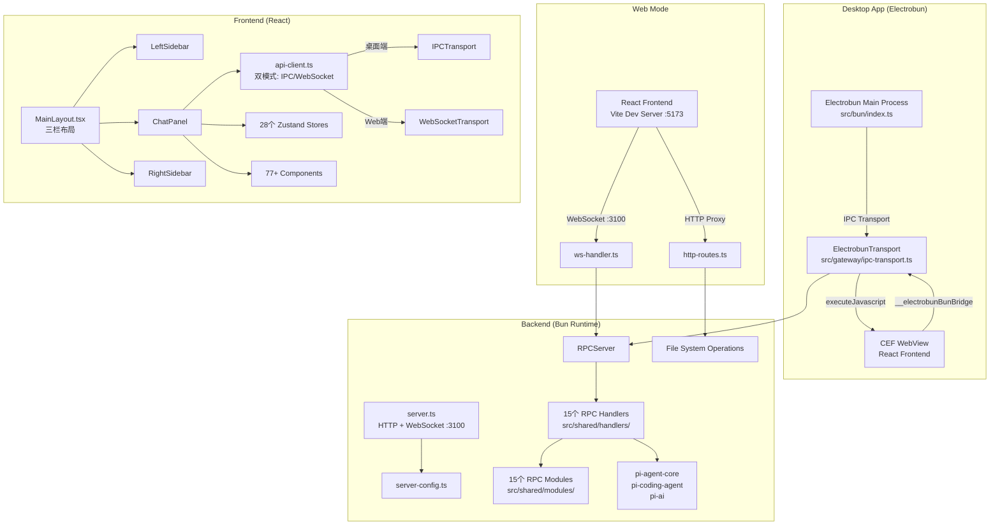

**关键发现**：

1. **双传输通道**：`api-client.ts` 已实现 IPC/WebSocket 双模式检测（`detectEnvironment()` 检查 `window.__electrobunBunBridge`）
2. **Handler 平台分支**：`rpc-schema.ts` 的 `HandlerOptions.platform` 已支持 `"desktop" | "web"`，需扩展为 `"mobile"`
3. **后端紧耦合本地文件系统**：`http-routes.ts` 的 `/file/`, `/fs/` 路由直接操作本地文件系统（`fs/promises`），需远程化

### 2.3 代码复用率评估

| 模块 | 文件数 | 预估行数 | 可直接复用 | 需适配 | 需重写 | 复用率 |
|------|--------|----------|-----------|--------|--------|--------|
| mainview/components/ | 77+ | ~8,000 | 60 | 17 | - | ~92% |
| mainview/stores/ | 28 | ~3,500 | 28 | - | - | 100% |
| mainview/hooks/ | 5 | ~150 | 5 | - | - | 100% |
| mainview/layouts/ | 3 | ~470 | 1 | 2 | - | ~85% |
| mainview/lib/ | 8 | ~700 | 6 | 2 | - | ~90% |
| shared/modules/ | 15 | ~1,500 | 15 | - | - | 100% |
| shared/handlers/ | 15 | ~2,000 | 15 | - | - | 100% |
| gateway/ | 3 | ~590 | 1 | 1 | 1 | ~60% |
| **总计** | **~154** | **~16,900** | **131** | **22** | **1** | **~90%** |

### 2.4 桌面耦合度分析

#### 高耦合（需隔离/移除）

| 文件 | 耦合点 | 处理方式 |
|------|--------|----------|
| `src/bun/index.ts` (130行) | Electrobun 主进程，BrowserWindow, BrowserView, ApplicationMenu | 整个文件移除，移动端不使用 |
| `src/gateway/ipc-transport.ts` (72行) | ElectrobunTransport 类，`executeJavascript`, `__piAgentIPC` | 条件编译或移除 |
| `electrobun.config.ts` (27行) | Electrobun 构建配置 | 移除，Capacitor 构建替代 |
| `src/mainview/lib/api-client.ts` L63-72 | `initSyncForDesktop()`, `setupElectrobunBridge()` | 条件编译隔离 |

#### 中等耦合（需适配）

| 文件 | 耦合点 | 处理方式 |
|------|--------|----------|
| `src/mainview/lib/api-client.ts` L199-203 | `detectEnvironment()` 检查 `window.__electrobunBunBridge` | 添加 `"mobile"` 环境 |
| `src/shared/rpc-schema.ts` L50 | `HandlerOptions.platform` 只有 `"desktop" \| "web"` | 扩展为 `"desktop" \| "web" \| "mobile"` |
| `src/gateway/ws-handler.ts` L78 | `registerAllHandlers(rpcServer, { platform: "web" })` | 移动端也用 WebSocket |
| `src/mainview/layouts/MainLayout.tsx` L50-56 | `Cmd/Ctrl+B` 快捷键 | 移动端需手势替代 |

#### 低耦合（可忽略）

| 文件 | 耦合点 | 处理方式 |
|------|--------|----------|
| `src/mainview/lib/api-client.ts` L208-209 | SSR fallback `ws://localhost:3100` | 仅 SSR 场景，移动端不触发 |
| `window.__piAgentIPC` 全局类型 | Electrobun IPC 回调 | 仅桌面端使用 |

---

## 3. 技术选型

### 3.1 方案对比

| 维度 | Capacitor | React Native | PWA | Flutter | 原生开发 |
|------|-----------|-------------|-----|---------|---------|
| **代码复用率** | **90%+** | 30-40% | 95%+ | 0% | 0% |
| **UI 组件复用** | 100% | 0% (需重写) | 100% | 0% | 0% |
| **Store 复用** | 100% | 100% | 100% | 0% | 0% |
| **团队学习成本** | **低** | 高 | 极低 | 高 | 极高 |
| **开发时间** | **6-10周** | 16-24周 | 3-4周 | 20-30周 | 30-40周 |
| **原生能力** | 高 (插件) | 原生 | 低 | 原生 | 原生 |
| **性能** | 良好 | 优秀 | 一般 | 优秀 | 优秀 |
| **热更新** | 可 | 否 | 是 | 否 | 否 |
| **商店分发** | 可 | 可 | 否 | 可 | 可 |
| **Mermaid/Markdown** | 直接复用 | 需 WebView | 直接复用 | 需重写 | 需重写 |
| **虚拟滚动** | 直接复用 | 需替代 | 直接复用 | 需重写 | 需重写 |
| **推送通知** | 插件支持 | 原生 | 有限 | 原生 | 原生 |
| **相机/相册** | 插件支持 | 原生 | 有限 | 原生 | 原生 |

### 3.2 推荐方案：Capacitor

**推荐使用 [Capacitor](https://capacitorjs.com/) 6.x 作为移动端框架。**

Capacitor 由 Ionic 团队维护，本质是将现有 Web 应用包装为原生移动应用，通过 WebView 渲染 React UI，同时提供 JavaScript API 访问原生设备能力。

### 3.3 选型理由

#### 代码复用（权重 40%）

- 现有 77+ React 组件、28 个 Zustand store、完整 Markdown/Mermaid 渲染管线**全部可直接复用**
- 项目重度依赖 DOM API（mermaid、remark、react-diff-viewer、prism-react-renderer），Capacitor 的 WebView 环境天然支持
- `@tanstack/react-virtual` 虚拟滚动在 WebView 中表现良好，React Native 方案需完全替代
- `api-client.ts` 的 WebSocket 模式与移动端天然契合

#### 团队技能（权重 25%）

- 团队已掌握 React + TypeScript + Tailwind CSS，Capacitor **零额外学习成本**
- 无需学习 Swift/Kotlin/Dart/RN 特有 API
- 调试工具链与 Web 开发完全一致（Chrome DevTools）

#### 时间成本（权重 20%）

- 预计 **6-10 周**完成双平台迁移（React Native 需 16-24 周）
- Capacitor 初始化仅需 1 天，核心工作集中在 UI 响应式适配和后端远程化

#### 性能（权重 15%）

- 现代 Android WebView（Chrome 90+）和 iOS WKWebView 性能已足够运行复杂 React 应用
- 列表虚拟化（`@tanstack/react-virtual`）确保大量消息场景流畅
- WebSocket 通信延迟在移动网络下可通过优化策略缓解

### 3.4 备选方案

| 方案 | 适用场景 | 切换时机 |
|------|---------|---------|
| **PWA** | 仅需移动浏览器访问，不需要商店分发 | Phase 1 阶段可先发布 PWA 验证市场 |
| **React Native** | 需要极致原生性能，或计划逐步替换 Web 组件 | 若 Capacitor 性能不满足时切换 |
| **Tauri Mobile** | 团队偏好 Rust，且接受实验性特性 | Tauri Mobile 稳定后评估 |

---

## 4. 目标架构设计

### 4.1 移动端架构图

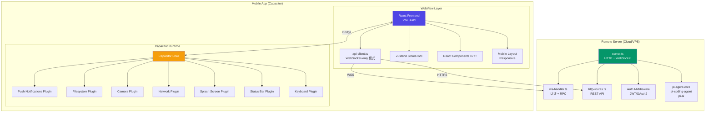

### 4.2 前端架构（Capacitor 包装层）

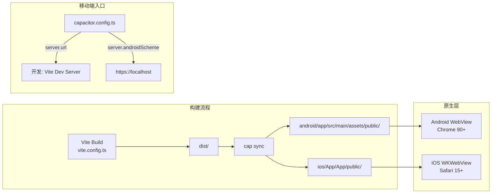

### 4.3 后端架构（远程化部署）

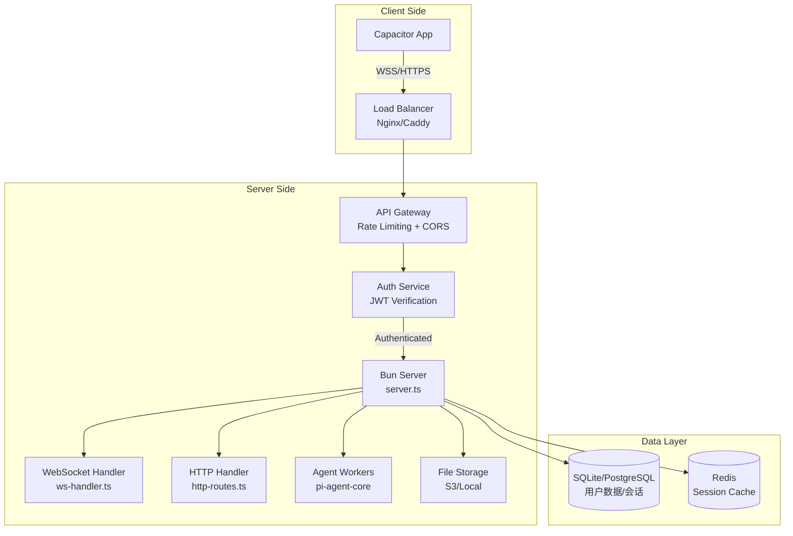

### 4.4 通信层设计

移动端通信架构与 Web 模式一致，均使用 WebSocket + HTTP 双通道：

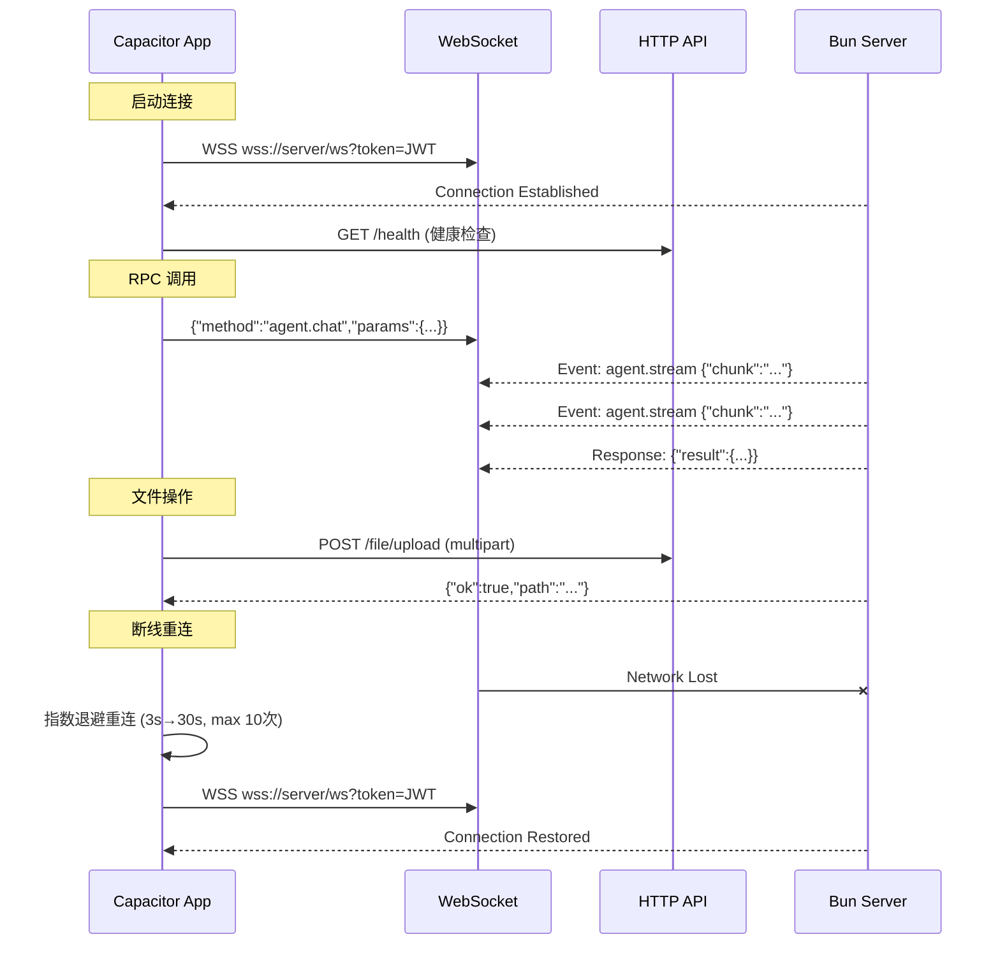

**WebSocket 重连策略**（已有实现，`api-client.ts` L147-197）：
- 基础延迟：3 秒
- 最大延迟：30 秒
- 指数退避：`3 * 2^attempt`
- 最大重试次数：10 次
- 移动端需额外优化：监听网络状态变化（`@capacitor/network`）主动触发重连

### 4.5 数据流架构

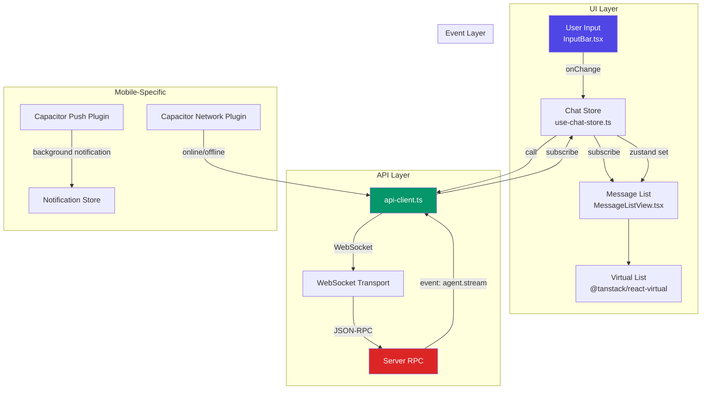

---

## 5. 详细改造方案

### 5.1 必须改造项（Hard Changes）

#### 5.1.1 后端服务远程化

**现状问题**：当前后端只能本地运行（`server.ts` 监听 `localhost:3100`），HTTP 路由直接操作本地文件系统。

**改造内容**：

1. **服务监听地址配置化**

`src/server-config.ts` 变更：
```typescript
// 新增
export const config = {
  host: process.env.HOST ?? "0.0.0.0", // 原来硬编码 localhost
  port: parseInt(process.env.PORT ?? "3100"),
  cors: {
    origins: process.env.CORS_ORIGINS?.split(",") ?? ["*"],
    methods: ["GET", "POST", "OPTIONS"],
    headers: ["Authorization", "Range", "Content-Type"],
  },
  // ... 现有配置
};
```

2. **CORS 配置动态化**

`src/gateway/http-routes.ts` L103-105 当前硬编码 `Access-Control-Allow-Origin: *`，需改为：
```typescript
const origin = req.headers.origin;
const allowed = cfg.cors.origins;
if (allowed.includes("*") || (origin && allowed.includes(origin))) {
  res.setHeader("Access-Control-Allow-Origin", origin ?? "*");
}
```

3. **文件操作远程化**

当前 `http-routes.ts` 的 `handleFileContent()`, `handleFileUpload()` 等直接操作 `fs/promises`。移动端场景下，后端仍然操作本地文件系统（Agent 运行机器），移动端通过 HTTP API 远程访问。**无需改动文件系统操作逻辑**，仅需确保 CORS 和认证正确。

#### 5.1.2 认证体系升级（JWT/OAuth2）

**现状问题**：
- `LoginPage.tsx` 使用简单 token 认证
- 默认 token 是 `"demo-test-token"`（安全隐患）
- Token 存储在 `localStorage`（XSS 风险）
- `ws-handler.ts` L31-35 仅做 `token !== cfg.authToken` 简单比对

**改造方案**：

Phase 1（最小可用）：保留 Token 认证，增强安全性

```typescript
// src/gateway/auth.ts (新文件)
import { createHmac, timingSafeEqual } from "crypto";

export function verifyToken(provided: string, expected: string): boolean {
  if (!provided || !expected) return false;
  const a = Buffer.from(provided);
  const b = Buffer.from(expected);
  if (a.length !== b.length) return false;
  return timingSafeEqual(a, b);
}

// 支持多 token（逗号分隔）
export function verifyAnyToken(provided: string, tokenList: string): boolean {
  return tokenList.split(",").some((t) => verifyToken(provided, t.trim()));
}
```

Phase 2（生产级）：JWT 认证

```typescript
// src/gateway/auth-jwt.ts (新文件)
import { verify } from "jsonwebtoken"; // 或使用 Bun 内置 JWT

interface JWTPayload {
  sub: string;       // 用户 ID
  projectId: string; // 项目 ID
  iat: number;
  exp: number;
}

export function verifyJWT(token: string, secret: string): JWTPayload | null {
  try {
    return verify(token, secret) as JWTPayload;
  } catch {
    return null;
  }
}
```

**认证流程变更**（`src/gateway/ws-handler.ts`）：

```typescript
// 现有 (L30-35)
const token = url.searchParams.get("token");
if (token !== cfg.authToken) {
  log.warn("Connection rejected: invalid token");
  socket.write("HTTP/1.1 401 Unauthorized\r\n\r\n");
  socket.destroy();
  return;
}

// 改造后
const token = url.searchParams.get("token")
  ?? req.headers.authorization?.replace("Bearer ", "");
const payload = verifyJWT(token, cfg.jwtSecret);
if (!payload) {
  log.warn("Connection rejected: invalid JWT");
  socket.write("HTTP/1.1 401 Unauthorized\r\n\r\n");
  socket.destroy();
  return;
}
// 将用户信息注入 RPC context
wss.handleUpgrade(req, socket, head, (ws) => {
  wss.emit("connection", ws, req, payload);
});
```

**前端 LoginPage 改造**（`src/mainview/components/LoginPage.tsx`）：

```typescript
// 现有 (L17)
setToken("demo-test-token");

// 改造后：移除默认 token，支持多种登录方式
// 1. Token 输入（开发/内部部署）
// 2. OAuth2 登录按钮（生产环境）
// 3. 扫码登录（移动端优先）
```

#### 5.1.3 WebSocket URL 动态化

**现状问题**：`api-client.ts` L208-209 硬编码 `ws://localhost:3100` 作为 SSR fallback。

**改造方案**：

```typescript
// src/mainview/lib/api-client.ts - getWebSocketUrl() 改造

private getWebSocketUrl(): string {
  const token = resolveAuthToken();

  // 优先级：URL 参数 > 环境变量 > localStorage > 自动检测
  // 1. URL 参数（部署时注入）
  const urlParam = new URLSearchParams(window.location.search).get("ws");
  if (urlParam) {
    return urlParam.includes("token=") ? urlParam : `${urlParam}?token=${token}`;
  }

  // 2. Capacitor 环境变量
  const serverUrl = (window as any).__CAPACITOR_SERVER_URL__;
  if (serverUrl) {
    return `${serverUrl}/ws?token=${token}`;
  }

  // 3. localStorage（手动配置）
  const stored = localStorage.getItem("rpc-websocket-url");
  if (stored) {
    return stored.includes("token=") ? stored : `${stored}?token=${token}`;
  }

  // 4. 自动检测（同源）
  const protocol = window.location.protocol === "https:" ? "wss:" : "ws:";
  return `${protocol}//${window.location.host}/ws?token=${token}`;
}
```

**Capacitor 环境变量注入**：

```typescript
// capacitor.config.ts
import type { CapacitorConfig } from '@capacitor/cli';

const config: CapacitorConfig = {
  appId: 'com.piagent.chat',
  appName: 'Pi Agent Chat',
  webDir: 'dist',
  server: {
    // 开发模式指向 Vite Dev Server
    url: process.env.CAP_DEBUG_URL || undefined,
    androidScheme: 'https',
    cleartext: true, // 开发环境允许 HTTP
  },
  plugins: {
    // ...
  }
};
```

#### 5.1.4 Electrobun IPC 代码隔离

**涉及文件和变更**：

| 文件 | 变更 |
|------|------|
| `src/bun/index.ts` | 整个文件 - 添加条件入口，移动端构建时排除 |
| `src/gateway/ipc-transport.ts` | 添加 `// @platform desktop` 注释，移动端构建时 tree-shake |
| `src/mainview/lib/api-client.ts` | 将 IPC 相关代码包裹在条件判断中 |
| `electrobun.config.ts` | 移动端构建时排除 |

**api-client.ts 具体改造**：

```typescript
// L63-72 initSyncForDesktop() → 条件编译
initSyncForDesktop(): void {
  // @ts-ignore - Electrobun only
  if (typeof IPCTransport === 'undefined') return; // 移动端安全退出
  if (this.client) return;
  const ipcTransport = new IPCTransport();
  // ... 其余代码不变
}

// L199-203 detectEnvironment() → 添加 mobile 检测
private detectEnvironment(): "electrobun" | "browser" | "mobile" {
  if (typeof window === "undefined") return "browser";
  if ((window as any).Capacitor) return "mobile"; // Capacitor 环境检测
  if (window.__electrobunBunBridge) return "electrobun";
  return "browser";
}

// L86-103 initialize() → 三路分支
async initialize(): Promise<void> {
  // ...
  const env = this.detectEnvironment();
  if (env === "electrobun") {
    this.initSyncForDesktop();
  } else {
    // mobile 和 browser 统一走 WebSocket
    this._transport = "websocket";
    // ...
  }
}
```

**rpc-schema.ts 平台扩展**：

```typescript
// src/shared/rpc-schema.ts L49-51
export interface HandlerOptions {
  platform: "desktop" | "web" | "mobile"; // 新增 "mobile"
}
```

**Vite 构建配置**（`vite.config.ts`）：

```typescript
export default defineConfig(({ mode }) => ({
  plugins: [react()],
  root: "src/mainview",
  publicDir: "public",
  define: {
    '__PLATFORM_MOBILE__': mode === 'mobile' ? 'true' : 'false',
    '__PLATFORM_DESKTOP__': mode === 'desktop' ? 'true' : 'false',
  },
  build: {
    outDir: mode === 'mobile' ? '../../dist-mobile' : '../../dist',
    // ... 现有 rollupOptions
    rollupOptions: {
      external: mode === 'mobile' ? ['electrobun'] : [],
    }
  }
}));
```

#### 5.1.5 移动端布局重构

**现状分析**（`src/mainview/layouts/MainLayout.tsx`）：

- 三栏布局：`LeftSidebar` + `ChatPanel` + `RightSidebar`
- 移动端（`breakpoint === "mobile"`）：侧边栏变为 85% 宽度 overlay drawer
- 已有 `onTouchStart` 事件处理（resize handles）
- 已有 backdrop overlay（`bg-black/50`）

**主要问题**：
1. `use-breakpoint.ts` 阈值 768 vs `MainLayout.tsx` 阈值 640（不一致）
2. `Cmd/Ctrl+B` 快捷键在移动端无意义
3. 两套独立的 breakpoint 系统（`use-layout-store.ts` + `use-sidebar-store.ts`）

**改造方案**：

1. **统一 breakpoint 阈值**

```typescript
// src/mainview/lib/breakpoints.ts (新文件，统一入口)
export const BREAKPOINTS = {
  mobile: 640,   // < 640px
  tablet: 1024,  // 640-1024px
  desktop: 1440, // 1024-1440px
  wide: Infinity, // >= 1440px
} as const;

export type Breakpoint = keyof typeof BREAKPOINTS;

export function getBreakpoint(width: number): Breakpoint {
  if (width < BREAKPOINTS.mobile) return "mobile";
  if (width < BREAKPOINTS.tablet) return "tablet";
  if (width < BREAKPOINTS.desktop) return "desktop";
  return "wide";
}
```

然后 `use-layout-store.ts`, `use-breakpoint.ts`, `MainLayout.tsx` 统一引用此文件。

2. **移动端导航方案**

```typescript
// 移动端底部 Tab 导航替代桌面端三栏布局
// 主界面：ChatPanel (全屏)
// 左划：LeftSidebar (Drawer)
// 右划：RightSidebar (Drawer)
// 底部 Tab：聊天 | 文件 | Git | 设置
```

3. **移除移动端快捷键绑定**

```typescript
// MainLayout.tsx L48-57 改造
useEffect(() => {
  if (breakpoint === "mobile") return; // 移动端跳过
  function onKeyDown(e: KeyboardEvent) {
    if ((e.metaKey || e.ctrlKey) && e.key === "b") {
      e.preventDefault();
      toggleSessionCollapse();
    }
  }
  window.addEventListener("keydown", onKeyDown);
  return () => window.removeEventListener("keydown", onKeyDown);
}, [toggleSessionCollapse, breakpoint]);
```

### 5.2 建议优化项（Soft Changes）

#### 5.2.1 触摸交互优化

| 组件 | 当前 | 优化 |
|------|------|------|
| `MainLayout.tsx` L79-103 | `onTouchStart/Move/End` 在 resize handle | 移动端隐藏 resize handle，使用 swipe gesture |
| `InputBar.tsx` | 无触摸优化 | 添加触摸区域扩大（min-height: 44px） |
| `MessageCard.tsx` | 无长按交互 | 添加长按菜单（复制/删除/重试） |
| `ChatPanel.tsx` | 无左/右划手势 | 添加 `useSwipe` hook，左划开侧边栏 |
| `ExplorerSidebar.tsx` | 无触摸交互 | 文件树节点添加触摸反馈 |

**触摸安全区域**（Safe Area）：

```css
/* tailwind.config.js 扩展 */
theme: {
  extend: {
    spacing: {
      'safe-top': 'env(safe-area-inset-top)',
      'safe-bottom': 'env(safe-area-inset-bottom)',
      'safe-left': 'env(safe-area-inset-left)',
      'safe-right': 'env(safe-area-inset-right)',
    }
  }
}
```

#### 5.2.2 虚拟键盘适配

```css
/* 移动端 InputBar 键盘适配 */
.chat-input-container {
  position: fixed;
  bottom: 0;
  left: 0;
  right: 0;
  /* Capacitor Keyboard 插件自动处理 visualViewport */
  padding-bottom: env(safe-area-inset-bottom);
}
```

```typescript
// Capacitor Keyboard 插件配置
// capacitor.config.ts
plugins: {
  Keyboard: {
    resize: 'body',        // 键盘弹出时调整 body
    resizeOnFullScreen: true,
  }
}
```

#### 5.2.3 离线模式与缓存

```typescript
// src/mainview/lib/offline-manager.ts (新文件)
import { Network } from '@capacitor/network';

class OfflineManager {
  private online = true;

  async init() {
    Network.addListener('networkStatusChange', (status) => {
      this.online = status.connected;
      // 通知 UI 层
      useAppStore.getState().setOnlineStatus(status.connected);
    });
  }

  isOnline(): boolean {
    return this.online;
  }
}

export const offlineManager = new OfflineManager();
```

**缓存策略**：
- 聊天历史：`localStorage` 缓存最近 100 条消息
- 静态资源：Service Worker 缓存（已有 `workbox-window` 依赖）
- API 响应：内存缓存 + 过期策略

#### 5.2.4 推送通知

当前已有 `pwa-channel.ts` 使用 Web Notifications API。移动端需要原生推送：

```typescript
// src/mainview/lib/channels/native-push-channel.ts (新文件)
import { PushNotifications } from '@capacitor/push-notifications';

const NativePushChannel: NotificationChannel = {
  name: "native-push",

  async init() {
    await PushNotifications.requestPermissions();
    await PushNotifications.register();

    PushNotifications.addListener('pushNotificationReceived', (notification) => {
      // 前台通知处理
    });

    PushNotifications.addListener('pushNotificationActionPerformed', (action) => {
      // 点击通知跳转
      const sessionId = action.notification.data?.sessionId;
      if (sessionId) {
        useSessionStore.getState().setActiveSession(sessionId);
      }
    });
  },

  send(event: GatewayEvent) {
    // 通过后端推送服务发送
    // 或者本地前台通知
  }
};
```

#### 5.2.5 文件上传适配（相机/相册）

```typescript
// src/mainview/components/chat/FileAttachment.tsx 改造
import { Camera, CameraResultType } from '@capacitor/camera';

async function handleMobileUpload() {
  const photo = await Camera.getPhoto({
    quality: 90,
    allowEditing: false,
    resultType: CameraResultType.Uri,
  });

  // 上传到服务端
  const formData = new FormData();
  const response = await fetch(photo.webPath);
  const blob = await response.blob();
  formData.append('file', blob, `photo.${photo.format}`);

  await fetch(`${apiClient.getBaseUrl()}/file/upload?path=/uploads/photo.${photo.format}`, {
    method: 'POST',
    headers: { Authorization: `Bearer ${apiClient.getAuthToken()}` },
    body: formData,
  });
}
```

#### 5.2.6 网络状态检测

```typescript
// api-client.ts 移动端重连增强
import { Network } from '@capacitor/network';

// 在 initialize() 中添加网络监听
if ((window as any).Capacitor) {
  Network.addListener('networkStatusChange', (status) => {
    if (status.connected && !this.wsTransport?.isConnected()) {
      // 网络恢复，立即触发重连（不等退避计时器）
      this._scheduleReconnectImmediate();
    }
  });
}
```

### 5.3 可保持不变的部分

以下代码在移动端可**完全复用，无需修改**：

| 模块 | 文件 | 说明 |
|------|------|------|
| **状态管理** | `src/mainview/stores/*.ts` (28个) | Zustand store 纯 JS 逻辑，平台无关 |
| **RPC Schema** | `src/shared/rpc-schema.ts` | 类型定义，仅需扩展 platform 类型 |
| **RPC Modules** | `src/shared/modules/*.ts` (15个) | 方法类型定义 |
| **RPC Handlers** | `src/shared/handlers/*.ts` (15个) | 服务端逻辑 |
| **API Client** | `src/mainview/lib/api-client.ts` | WebSocket 模式完全可用 |
| **Markdown 渲染** | `src/mainview/components/chat/CachedReactMarkdown.tsx` | DOM-based，WebView 兼容 |
| **Mermaid 渲染** | `src/mainview/components/chat/mermaid/*.tsx` (3个) | DOM-based，WebView 兼容 |
| **代码高亮** | `src/mainview/components/chat/preview/*.tsx` (12个) | DOM-based |
| **Diff 查看** | `src/mainview/components/diff/DiffViewerPanel.tsx` | DOM-based |
| **虚拟列表** | `src/mainview/components/chat/MessageListView.tsx` | `@tanstack/react-virtual` 兼容 |
| **通知系统** | `src/mainview/stores/use-notification-store.ts` | 纯状态管理 |
| **通知网关** | `src/mainview/lib/notification-gateway.ts` | 发布/订阅模式，平台无关 |
| **i18n** | `src/mainview/lib/i18n.ts` | 完全兼容 |
| **消息映射** | `src/mainview/lib/message-mapper.ts` | 纯数据处理 |
| **Turn 聚合** | `src/mainview/lib/turn-aggregator.ts` | 纯数据处理 |
| **Chat Store** | `src/mainview/stores/use-chat-store.ts` | 消息状态管理 |
| **Session Store** | `src/mainview/stores/use-session-store.ts` | 会话管理 |
| **Agent Store** | `src/mainview/stores/use-agent-store.ts` | Agent 状态 |
| **工具渲染** | `src/mainview/components/chat/tool-renderers/*.tsx` (5个) | Bash/Read/Write/Subagent/UI Card |
| **主题系统** | `src/mainview/stores/use-theme-store.ts` | 亮/暗色切换 |
| **Z-Index 管理** | `src/mainview/lib/z-index.ts` | 纯常量 |
| **错误边界** | `src/mainview/components/ErrorBoundary.tsx` | React 标准 |
| **自定义入口注册** | `src/mainview/lib/custom-entry-registry.ts` | 纯 JS |

---

## 6. 移动端 UI/UX 重构方案

### 6.1 当前 UI 问题分析

| 问题 | 位置 | 影响 |
|------|------|------|
| Breakpoint 阈值不一致 | `use-breakpoint.ts` (768) vs `MainLayout.tsx` (640) | 移动端判断行为不一致 |
| 无底部安全区域适配 | `MainLayout.tsx` 全局 | iPhone X+ 底部被遮挡 |
| 三栏布局在小屏幕拥挤 | `MainLayout.tsx` | < 640px 需要单栏 |
| 输入框固定底部无键盘适配 | `InputBar.tsx` | 键盘弹出时遮挡消息 |
| 无手势导航 | 全局 | 移动端用户习惯左划/右划 |
| Tab Bar 难以触摸 | `TabBar.tsx` | 按钮过小（< 44px） |
| 右键菜单不可用 | `ExplorerSidebar.tsx` `ContextMenu.tsx` | 触摸设备无右键 |
| 拖拽 resize 不适用 | `MainLayout.tsx` L66-104 | 移动端用固定宽度 drawer |

### 6.2 移动端交互范式

| 交互 | 桌面端 | 移动端 |
|------|--------|--------|
| 导航 | 侧边栏固定/折叠 | 底部 Tab + 抽屉式侧边栏 |
| 切换侧边栏 | `Cmd/Ctrl+B` | 左划手势 / 底部 Tab |
| 消息操作 | 鼠标悬停 + 右键 | 长按弹出菜单 |
| 代码复制 | 点击复制按钮 | 长按代码块 → 复制 |
| 文件浏览 | 树形 + 点击展开 | 手风琴式 + tap 展开 |
| 输入 | 键盘 `Enter` 发送 | 虚拟键盘 + 发送按钮 |
| 滚动 | 鼠标滚轮 + 原生滚动 | 触摸滚动 + momentum |
| 缩放 | 无 | 双指缩放代码块 |
| 返回 | 鼠标点击 | 系统返回键 / 左上角返回 |

### 6.3 信息架构重构（导航方案）

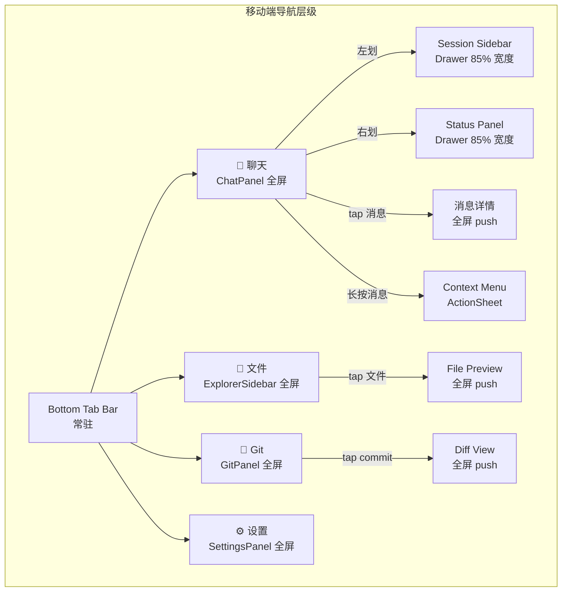

**移动端 Tab 配置**：

```typescript
// src/mainview/components/tab-bar/MobileTabBar.tsx (新文件)
const MOBILE_TABS = [
  { id: "chat",    icon: MessageSquare, label: t("tabs.chat") },
  { id: "files",   icon: FolderOpen,    label: t("tabs.files") },
  { id: "git",     icon: GitBranch,     label: t("tabs.git") },
  { id: "settings",icon: Settings,      label: t("tabs.settings") },
];
```

### 6.4 组件级改造方案

#### 6.4.1 ChatPanel (`src/mainview/components/chat/ChatPanel.tsx`, 603行)

| 改造项 | 说明 |
|--------|------|
| 移除 `PanelLeft/PanelRight` 按钮 | 移动端用手势代替 |
| `InputBar` 固定底部 | 添加 `position: fixed` + safe-area padding |
| 消息列表全屏 | 移除左右侧边栏空间预留 |
| 添加 `QuickActionToolbar` 横向滚动 | 移动端操作按钮改为可滑动 |
| `TokenStatusBar` 移至顶部 | 底部空间让给输入框 |

#### 6.4.2 InputBar (`src/mainview/components/chat/InputBar.tsx`, 174行)

| 改造项 | 说明 |
|--------|------|
| 触摸区域扩大 | `min-height: 44px`, `min-width: 44px` |
| 移除 `Maximize2/Minimize2` 按钮 | 移动端固定单行/展开模式 |
| 发送按钮放大 | `w-10 h-10` → `w-12 h-12` |
| 添加相机/附件按钮 | 调用 Capacitor Camera/Filesystem |
| 键盘适配 | `padding-bottom: env(safe-area-inset-bottom)` |

#### 6.4.3 MessageCard / MessageBubble (`src/mainview/components/chat/`)

| 改造项 | 说明 |
|--------|------|
| 添加长按手势 | `onTouchStart` + 延迟触发 context menu |
| 代码块横向滚动 | `overflow-x: auto` + `-webkit-overflow-scrolling: touch` |
| 缩小 padding | `p-4` → `p-3` (移动端空间紧凑) |
| 复制按钮增大 | 触摸区域 >= 44px |

#### 6.4.4 LeftSidebar (`src/mainview/components/left-sidebar/`)

| 改造项 | 说明 |
|--------|------|
| 移动端仅作为 Drawer | 从左侧滑出，85% 宽度 |
| 添加关闭按钮 | 右上角 X 按钮 |
| Session 列表项增大 | `min-h-[48px]` |
| 滑动删除 | 支持左划删除 session |

#### 6.4.5 RightSidebar (`src/mainview/components/right-sidebar/`)

| 改造项 | 说明 |
|--------|------|
| 移动端仅作为 Drawer | 从右侧滑出 |
| Tab 切换改为顶部横向滚动 | 替代纵向 Tab |
| 内容面板全高 | 无 resize handle |

#### 6.4.6 ExplorerSidebar (`src/mainview/components/explorer/`)

| 改造项 | 说明 |
|--------|------|
| `ContextMenu.tsx` 改为 ActionSheet | 移动端从底部弹出 |
| 文件树节点触摸反馈 | `active:bg-gray-100` |
| `InlineInput.tsx` 自动聚焦 | 重命名时弹出软键盘 |

#### 6.4.7 LoginPage (`src/mainview/components/LoginPage.tsx`)

| 改造项 | 说明 |
|--------|------|
| 移除默认 token | `setToken("")` |
| 添加服务器 URL 输入框 | 移动端需要指定后端地址 |
| 添加 OAuth2 登录按钮 | 调用系统浏览器 |
| 添加扫码登录 | 移动端优先 |
| 支持生物识别 | Capacitor BiometricAuth 插件 |

#### 6.4.8 TabBar (`src/mainview/components/tab-bar/TabBar.tsx`)

| 改造项 | 说明 |
|--------|------|
| 移动端改为底部 Tab | `position: fixed; bottom: 0` |
| Tab 按钮增大 | 图标 24px + 文字，触摸 >= 48px |
| 安全区域适配 | `padding-bottom: env(safe-area-inset-bottom)` |

#### 6.4.9 DiffViewerPanel (`src/mainview/components/diff/DiffViewerPanel.tsx`)

| 改造项 | 说明 |
|--------|------|
| 横向滚动优化 | 代码 diff 区域需要可滑动 |
| 全屏模式 | 移动端默认全屏显示 diff |
| 关闭按钮 | 左上角返回箭头 |

#### 6.4.10 Mermaid 渲染器 (`src/mainview/components/chat/mermaid/`)

| 改造项 | 说明 |
|--------|------|
| `MermaidFullscreen.tsx` | 移动端改为全屏 push 页面 |
| 缩放支持 | 双指缩放 SVG |

### 6.5 响应式断点策略

**统一断点系统**（替换当前两套不一致的系统）：

```typescript
// src/mainview/lib/breakpoints.ts
export const BREAKPOINTS = {
  mobile: 640,
  tablet: 1024,
  desktop: 1440,
  wide: Infinity,
} as const;
```

| 断点 | 宽度范围 | 布局 | 导航 |
|------|----------|------|------|
| mobile | < 640px | 单栏全屏 | 底部 Tab + Drawer |
| tablet | 640-1024px | 双栏（Chat + 可变侧栏） | 侧边栏 Tab + 折叠 |
| desktop | 1024-1440px | 三栏 | 侧边栏固定 + 快捷键 |
| wide | >= 1440px | 三栏宽屏 | 侧边栏固定 + 快捷键 |

**需更新的文件**：
- `src/mainview/layouts/use-layout-store.ts` L27-32 → 引用 `breakpoints.ts`
- `src/mainview/hooks/use-breakpoint.ts` L4-8 → 引用 `breakpoints.ts`
- `src/mainview/layouts/MainLayout.tsx` L59-64 → 引用 `breakpoints.ts`

### 6.6 手势与动画

```typescript
// src/mainview/hooks/use-gesture.ts (新文件)
import { useCallback, useRef } from 'react';

interface SwipeConfig {
  onSwipeLeft?: () => void;
  onSwipeRight?: () => void;
  threshold?: number; // 默认 50px
}

export function useSwipe(config: SwipeConfig) {
  const startX = useRef(0);
  const startY = useRef(0);
  const threshold = config.threshold ?? 50;

  const onTouchStart = useCallback((e: React.TouchEvent) => {
    startX.current = e.touches[0].clientX;
    startY.current = e.touches[0].clientY;
  }, []);

  const onTouchEnd = useCallback((e: React.TouchEvent) => {
    const dx = e.changedTouches[0].clientX - startX.current;
    const dy = e.changedTouches[0].clientY - startY.current;

    // 忽略垂直滑动
    if (Math.abs(dy) > Math.abs(dx)) return;
    if (Math.abs(dx) < threshold) return;

    if (dx < 0) config.onSwipeLeft?.();
    else config.onSwipeRight?.();
  }, [config, threshold]);

  return { onTouchStart, onTouchEnd };
}
```

**动画方案**：

```css
/* Drawer 滑入/滑出动画 */
.drawer-enter {
  transform: translateX(-100%);
  transition: transform 0.3s cubic-bezier(0.4, 0, 0.2, 1);
}
.drawer-enter-active {
  transform: translateX(0);
}

/* 底部 Tab 切换动画 */
.tab-content-enter {
  opacity: 0;
  transform: translateY(8px);
}
.tab-content-enter-active {
  opacity: 1;
  transform: translateY(0);
  transition: all 0.2s ease-out;
}
```

---

## 7. 后端远程化方案

### 7.1 当前后端架构

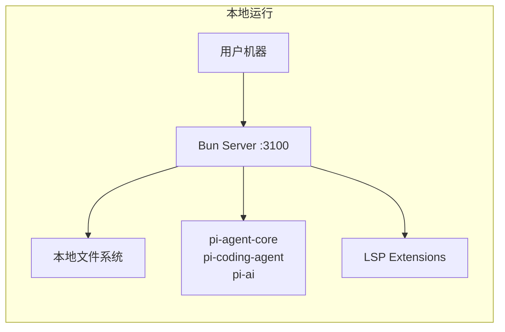

**核心特征**：
- 服务端运行在用户本地机器上
- 直接访问本地文件系统（文件读写、Git 操作、LSP 通信）
- pi-agent 扩展（`PI_EXT_*`）运行在本地进程
- WebSocket 和 HTTP 仅监听 localhost

### 7.2 部署架构设计

#### 方案 A：自托管模式（推荐，Phase 1-2）

用户在自己的开发机/服务器上运行后端，移动端通过网络连接。

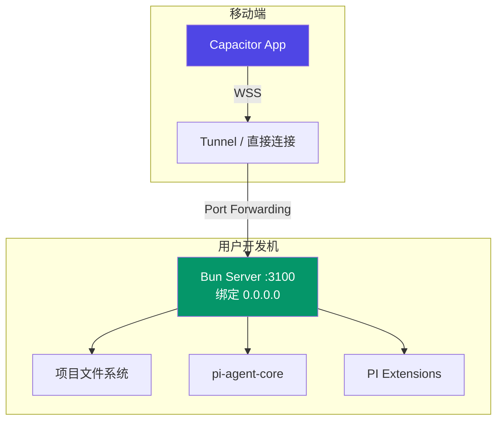

**网络方案**：

| 方案 | 配置 | 适用场景 |
|------|------|---------|
| 直接局域网 | 服务端绑定 `0.0.0.0:3100`，移动端连接 `ws://192.168.x.x:3100` | 同一局域网 |
| ngrok/cloudflared tunnel | `ngrok tcp 3100` | 远程开发 |
| Tailscale/WireGuard | 私有 VPN | 企业内网 |
| 反向代理 (Nginx) | SSL termination + WebSocket upgrade | VPS 部署 |

#### 方案 B：云托管模式（Phase 3+）

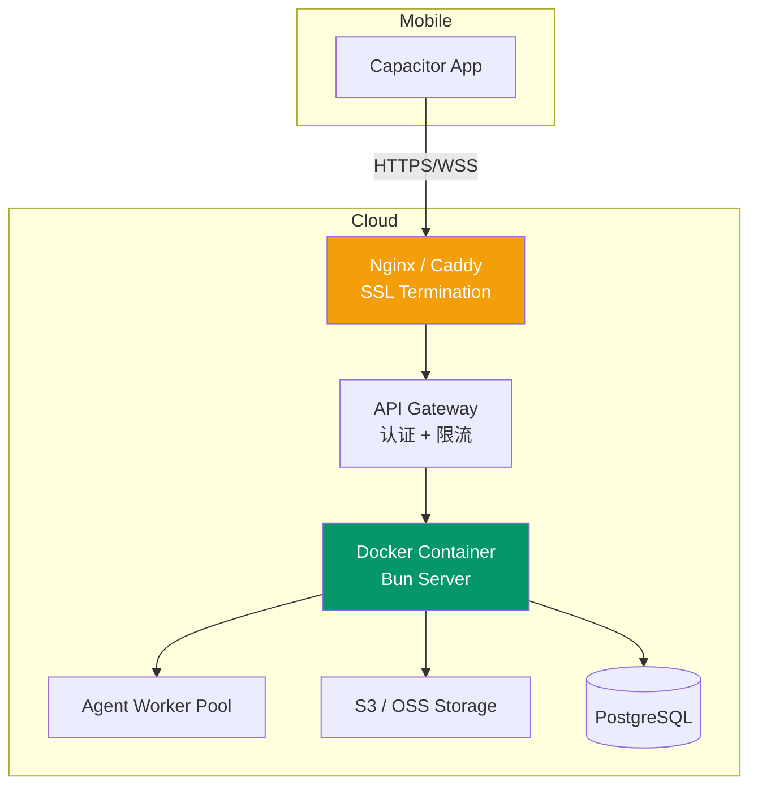

### 7.3 认证与安全

#### 安全清单

| 项 | 当前 | 目标 |
|------|------|------|
| Token 存储 | `localStorage` | Capacitor SecureStorage / Keychain |
| Token 类型 | 明文字符串 | JWT (HS256/RS256) |
| Token 传输 | URL query `?token=xxx` | WebSocket header `Authorization: Bearer` |
| HTTPS | 无 | 强制 HTTPS (WSS) |
| CORS | `*` | 白名单域名 |
| Rate Limiting | 无 | 60 req/min/user |
| 文件路径校验 | 有 (`isPathAllowed`) | 保持 + 强化 |

#### JWT Token 结构

```json
{
  "sub": "user-uuid",
  "projectId": "project-uuid",
  "serverUrl": "wss://user-server.example.com",
  "iat": 1715000000,
  "exp": 1715086400
}
```

### 7.4 数据隔离与多租户

当前系统为单用户设计。多租户支持需要：

1. **Session 隔离**：每个用户的 session 独立存储
2. **文件系统沙箱**：限制每个用户可访问的目录范围
3. **Agent 实例隔离**：每个用户独立的 pi-agent 进程
4. **WebSocket 连接管理**：支持同一用户多设备连接

```typescript
// src/gateway/ws-handler.ts 多租户改造示意
wss.on("connection", (ws: WebSocket, req, payload: JWTPayload) => {
  const userId = payload.sub;
  const projectId = payload.projectId;

  // 每个连接创建独立的 RPC handler 上下文
  const context = { userId, projectId, allowedRoots: getAllowedRootsForUser(userId) };
  const rpcServer = new RPCServer(wsTransport);
  registerAllHandlers(rpcServer, { platform: "mobile", context });
});
```

### 7.5 API 网关设计

```nginx
# nginx.conf
server {
    listen 443 ssl http2;
    server_name api.piagent.chat;

    # SSL
    ssl_certificate /etc/ssl/certs/piagent.crt;
    ssl_certificate_key /etc/ssl/private/piagent.key;

    # WebSocket upgrade
    location /ws {
        proxy_pass http://127.0.0.1:3100;
        proxy_http_version 1.1;
        proxy_set_header Upgrade $http_upgrade;
        proxy_set_header Connection "upgrade";
        proxy_set_header X-Real-IP $remote_addr;
        proxy_read_timeout 86400;
    }

    # REST API
    location / {
        proxy_pass http://127.0.0.1:3100;
        proxy_set_header Host $host;
        proxy_set_header X-Real-IP $remote_addr;
        proxy_set_header X-Forwarded-For $proxy_add_x_forwarded_for;
        proxy_set_header X-Forwarded-Proto $scheme;

        # 文件上传限制
        client_max_body_size 50M;
    }

    # Rate limiting
    limit_req_zone $binary_remote_addr zone=api:10m rate=60r/m;
    limit_req zone=api burst=20 nodelay;
}
```

---

## 8. Capacitor 集成方案

### 8.1 项目初始化

```bash
# 1. 安装 Capacitor
npm install @capacitor/core @capacitor/cli
npx cap init "Pi Agent Chat" "com.piagent.chat" --web-dir dist

# 2. 安装平台
npm install @capacitor/android
npx cap add android

# 3. 安装必要插件
npm install @capacitor/push-notifications
npm install @capacitor/network
npm install @capacitor/camera
npm install @capacitor/filesystem
npm install @capacitor/keyboard
npm install @capacitor/status-bar
npm install @capacitor/splash-screen
npm install @capacitor/haptics
npm install @capacitor/app
npm install @capacitor/preferences  # 安全存储
```

### 8.2 平台配置（Android）

#### capacitor.config.ts

```typescript
import type { CapacitorConfig } from '@capacitor/cli';

const config: CapacitorConfig = {
  appId: 'com.piagent.chat',
  appName: 'Pi Agent Chat',
  webDir: 'dist',
  bundledWebRuntime: false,

  server: {
    androidScheme: 'https',
    cleartext: true,
    // 开发模式：取消注释以连接 Vite Dev Server
    // url: 'http://192.168.x.x:5173',
  },

  plugins: {
    SplashScreen: {
      launchShowDuration: 2000,
      launchAutoHide: true,
      backgroundColor: '#1e1e2e',
      showSpinner: true,
      spinnerColor: '#818cf8',
    },
    StatusBar: {
      style: 'DARK',
      backgroundColor: '#1e1e2e',
    },
    Keyboard: {
      resize: 'body',
      resizeOnFullScreen: true,
    },
    PushNotifications: {
      presentationOptions: ['badge', 'sound', 'alert'],
    },
  },

  android: {
    buildOptions: {
      keystorePath: 'android/keystore.jks',
      keystoreAlias: 'piagent',
    },
    allowMixedContent: true,
  },
};

export default config;
```

#### AndroidManifest.xml 补充

```xml
<!-- android/app/src/main/AndroidManifest.xml -->
<manifest xmlns:android="http://schemas.android.com/apk/res/android">
    <!-- 网络权限 -->
    <uses-permission android:name="android.permission.INTERNET" />
    <uses-permission android:name="android.permission.ACCESS_NETWORK_STATE" />

    <!-- 推送通知 -->
    <uses-permission android:name="android.permission.POST_NOTIFICATIONS" />

    <!-- 相机（文件上传） -->
    <uses-permission android:name="android.permission.CAMERA" />
    <uses-feature android:name="android.hardware.camera" android:required="false" />

    <!-- 文件读取 -->
    <uses-permission android:name="android.permission.READ_EXTERNAL_STORAGE" />

    <application
        android:usesCleartextTraffic="true"
        android:networkSecurityConfig="@xml/network_security_config">
        <!-- ... -->
    </application>
</manifest>
```

```xml
<!-- android/app/src/main/res/xml/network_security_config.xml -->
<network-security-config>
    <base-config cleartextTrafficPermitted="true">
        <trust-anchors>
            <certificates src="system" />
        </trust-anchors>
    </base-config>
    <domain-config cleartextTrafficPermitted="true">
        <domain includeSubdomains="true">10.0.0.0/8</domain>
        <domain includeSubdomains="true">192.168.0.0/16</domain>
    </domain-config>
</network-security-config>
```

#### build.gradle 配置

```groovy
// android/app/build.gradle
android {
    compileSdk 34
    defaultConfig {
        applicationId "com.piagent.chat"
        minSdk 26        // Android 8.0+
        targetSdk 34
        versionCode 1
        versionName "1.0.0"
    }
    // ...
}
```

### 8.3 平台配置（iOS）

#### iOS 权限 (Info.plist)

```xml
<!-- ios/App/App/Info.plist -->
<key>NSCameraUsageDescription</key>
<string>Pi Agent Chat 需要访问相机以拍摄和上传文件</string>
<key>NSPhotoLibraryUsageDescription</key>
<string>Pi Agent Chat 需要访问相册以选择和上传文件</string>
<key>NSAppTransportSecurity</key>
<dict>
    <key>NSAllowsArbitraryLoads</key>
    <true/>
    <key>NSAllowsLocalNetworking</key>
    <true/>
</dict>
```

### 8.4 原生插件需求清单

| 插件 | 包名 | 用途 | 优先级 |
|------|------|------|--------|
| Network | `@capacitor/network` | 网络状态检测，触发重连 | P0 |
| Keyboard | `@capacitor/keyboard` | 虚拟键盘适配 | P0 |
| StatusBar | `@capacitor/status-bar` | 状态栏颜色/样式 | P0 |
| SplashScreen | `@capacitor/splash-screen` | 启动画面 | P0 |
| Preferences | `@capacitor/preferences` | 安全存储 token | P0 |
| Push Notifications | `@capacitor/push-notifications` | 后台推送 | P1 |
| Camera | `@capacitor/camera` | 相机拍照上传 | P1 |
| Filesystem | `@capacitor/filesystem` | 本地文件缓存 | P1 |
| Haptics | `@capacitor/haptics` | 触觉反馈 | P2 |
| App | `@capacitor/app` | App 生命周期、深度链接 | P2 |
| Share | `@capacitor/share` | 分享消息/代码 | P2 |
| Local Notifications | `@capacitor/local-notifications` | 前台通知 | P2 |
| BiometricAuth | `@aparajita/capacitor-biometric-auth` | 生物识别登录 | P3 |

### 8.5 构建与打包流程

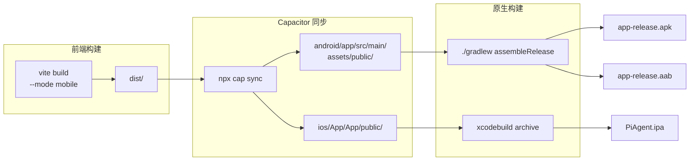

**package.json 新增 scripts**：

```json
{
  "scripts": {
    "build:mobile": "vite build --mode mobile",
    "cap:sync": "npm run build:mobile && npx cap sync",
    "cap:android": "npm run cap:sync && npx cap open android",
    "cap:ios": "npm run cap:sync && npx cap open ios",
    "cap:run:android": "npm run cap:sync && npx cap run android",
    "cap:run:ios": "npm run cap:sync && npx cap run ios"
  }
}
```

---

## 9. 测试策略

### 9.1 单元测试迁移

当前测试框架：Vitest（`vitest.config.ts`）

| 测试类型 | 当前 | 迁移方案 |
|----------|------|---------|
| Store 测试 | Vitest | 直接复用，Zustand store 平台无关 |
| Lib 测试 | Vitest | 直接复用（message-mapper, turn-aggregator 等） |
| 组件测试 | Vitest + @testing-library/react | 直接复用，添加移动端 viewport 测试 |
| Handler 测试 | Vitest | 直接复用，测试 `platform: "mobile"` 分支 |

**新增测试场景**：

```typescript
// test/mobile/api-client.test.ts
describe("APIClient - Mobile Mode", () => {
  it("should detect Capacitor environment", () => {
    (window as any).Capacitor = { isNativePlatform: () => true };
    const client = new APIClientImpl();
    expect(client.detectEnvironment()).toBe("mobile");
  });

  it("should use WebSocket in mobile mode", async () => {
    // ...
  });
});

// test/mobile/breakpoints.test.ts
describe("Unified Breakpoints", () => {
  it("should classify <640 as mobile", () => {
    expect(getBreakpoint(320)).toBe("mobile");
    expect(getBreakpoint(639)).toBe("mobile");
  });
});
```

### 9.2 E2E 测试迁移

当前框架：Playwright（`playwright.config.ts`）

**移动端 E2E 策略**：

```typescript
// playwright.config.ts - 移动端配置
export default defineConfig({
  projects: [
    {
      name: "mobile-android",
      use: {
        ...devices["Pixel 5"],
        viewport: { width: 393, height: 851 },
        deviceScaleFactor: 2.625,
        isMobile: true,
        hasTouch: true,
      },
    },
    {
      name: "mobile-iphone",
      use: {
        ...devices["iPhone 14 Pro"],
        viewport: { width: 393, height: 852 },
        deviceScaleFactor: 3,
        isMobile: true,
        hasTouch: true,
      },
    },
  ],
});
```

**E2E 测试用例**：

| 场景 | 测试内容 |
|------|---------|
| 登录 | 输入 token + 服务器 URL → 连接成功 |
| 聊天 | 发送消息 → 收到 AI 回复 |
| 侧边栏 | 左划手势 → 左侧边栏出现 |
| Tab 切换 | 点击底部 Tab → 切换到对应页面 |
| 文件上传 | 点击附件按钮 → 选择图片 → 上传成功 |
| 离线恢复 | 断网 → 提示离线 → 恢复网络 → 自动重连 |
| 主题切换 | 设置页面切换主题 → 界面更新 |

### 9.3 设备兼容性测试

| 设备类别 | 测试设备 | 屏幕尺寸 | 系统版本 |
|----------|---------|----------|---------|
| Android 高端 | Samsung Galaxy S24 | 6.2" 1080x2340 | Android 14 |
| Android 中端 | Google Pixel 6 | 6.4" 1080x2400 | Android 14 |
| Android 低端 | Redmi Note 12 | 6.67" 1080x2400 | Android 13 |
| iOS 标准 | iPhone 15 | 6.1" 1179x2556 | iOS 17 |
| iOS 小屏 | iPhone SE (3rd) | 4.7" 750x1334 | iOS 17 |
| iOS 大屏 | iPhone 15 Pro Max | 6.7" 1290x2796 | iOS 17 |
| iPad | iPad Air (5th) | 10.9" 1640x2360 | iPadOS 17 |
| 折叠屏 | Samsung Galaxy Z Fold 5 | 7.6" (展开) | Android 14 |

**关键测试指标**：

| 指标 | 目标 | 测试方法 |
|------|------|---------|
| 首屏加载时间 | < 3s | Lighthouse / 手动计时 |
| 消息列表 FPS | >= 30fps | Chrome DevTools Performance |
| WebSocket 连接时间 | < 2s | Network waterfall |
| 内存占用 | < 200MB | Chrome DevTools Memory |
| 电池消耗 | < 5%/小时 | 日常使用测试 |

---

## 10. 实施路线图

### 10.1 Phase 1: 基础移动化（1-2 周）

**目标**：在 Android 设备上跑通基本聊天功能

| 任务 | 优先级 | 预估工时 | 涉及文件 |
|------|--------|---------|---------|
| Capacitor 项目初始化 | P0 | 4h | 新文件 |
| `vite.config.ts` 添加 mobile mode | P0 | 2h | `vite.config.ts` |
| `api-client.ts` 添加 mobile 环境检测 | P0 | 2h | `src/mainview/lib/api-client.ts` |
| `rpc-schema.ts` 扩展 platform 类型 | P0 | 0.5h | `src/shared/rpc-schema.ts` |
| 统一 breakpoint 系统 | P0 | 3h | 新文件 + `use-layout-store.ts` + `use-breakpoint.ts` |
| `LoginPage.tsx` 添加服务器 URL 输入 | P0 | 2h | `src/mainview/components/LoginPage.tsx` |
| 移除移动端快捷键绑定 | P1 | 1h | `src/mainview/layouts/MainLayout.tsx` |
| Android 基础配置 | P0 | 4h | `capacitor.config.ts` + AndroidManifest |
| 网络插件集成（重连优化） | P0 | 2h | `src/mainview/lib/api-client.ts` |
| 基础 E2E 测试（登录+聊天） | P1 | 4h | 新测试文件 |

**交付物**：
- 可在 Android 模拟器上运行的 APK
- 基本聊天功能可用（连接远程后端）
- 登录页面支持 token + 服务器 URL 输入

### 10.2 Phase 2: UI 重构（2-3 周）

**目标**：移动端 UI/UX 达到可发布标准

| 任务 | 优先级 | 预估工时 | 涉及文件 |
|------|--------|---------|---------|
| MobileTabBar 组件开发 | P0 | 8h | 新组件 `MobileTabBar.tsx` |
| 移动端 MainLayout 重构 | P0 | 16h | `src/mainview/layouts/MainLayout.tsx` |
| Drawer 组件封装 | P0 | 8h | 新组件 `MobileDrawer.tsx` |
| `InputBar.tsx` 移动端适配 | P0 | 6h | `src/mainview/components/chat/InputBar.tsx` |
| `MessageCard/MessageBubble` 触摸优化 | P0 | 8h | 相关组件 |
| 手势导航 hook | P0 | 4h | 新 hook `use-gesture.ts` |
| Safe Area 适配 | P0 | 4h | Tailwind 配置 + 全局样式 |
| `ExplorerSidebar` 移动端适配 | P1 | 6h | 相关组件 |
| `GitPanel` 移动端适配 | P1 | 4h | 相关组件 |
| `SettingsPanel` 移动端适配 | P1 | 4h | 相关组件 |
| 长按上下文菜单 | P1 | 4h | 新组件 `MobileContextMenu.tsx` |
| 文件上传（相机/相册） | P1 | 4h | `FileAttachment.tsx` |
| 动画和过渡效果 | P2 | 6h | CSS + Framer Motion |
| 暗色主题移动端测试 | P1 | 2h | 全局 |
| 移动端 E2E 测试补充 | P1 | 8h | 新测试文件 |

**交付物**：
- 移动端完整 UI（底部 Tab + Drawer + 全屏页面）
- 触摸交互流畅
- 所有核心功能可通过移动端 UI 操作

### 10.3 Phase 3: 后端远程化（2-3 周）

**目标**：支持远程后端部署，多用户安全访问

| 任务 | 优先级 | 预估工时 | 涉及文件 |
|------|--------|---------|---------|
| JWT 认证实现 | P0 | 8h | 新文件 `src/gateway/auth-jwt.ts` |
| `ws-handler.ts` JWT 验证集成 | P0 | 4h | `src/gateway/ws-handler.ts` |
| `http-routes.ts` JWT 验证集成 | P0 | 4h | `src/gateway/http-routes.ts` |
| Token 安全存储（Capacitor Preferences） | P0 | 4h | `LoginPage.tsx` + 新 lib |
| CORS 配置动态化 | P0 | 2h | `http-routes.ts` |
| Rate Limiting 中间件 | P1 | 4h | 新文件 |
| Nginx 反向代理配置 | P1 | 4h | 配置文件 |
| 部署文档编写 | P1 | 4h | 文档 |
| 推送通知集成 | P2 | 8h | 新 channel + 后端推送服务 |
| 离线缓存优化 | P2 | 6h | Service Worker + 缓存策略 |

**交付物**：
- JWT 认证体系
- Nginx 部署配置
- 安全加固报告

### 10.4 Phase 4: 集成测试与上架（1-2 周）

| 任务 | 优先级 | 预估工时 |
|------|--------|---------|
| 设备兼容性测试（8+ 设备） | P0 | 16h |
| 性能优化（首屏、内存） | P0 | 8h |
| App 签名和打包 | P0 | 4h |
| Google Play Store 提交材料 | P0 | 8h |
| 隐私政策和用户协议 | P0 | 4h |
| Bug 修复和回归测试 | P0 | 16h |
| App Store (iOS) 提交（如适用） | P1 | 8h |

### 10.5 里程碑与交付物

| 里程碑 | 时间点 | 交付物 | 验收标准 |
|--------|--------|--------|---------|
| M1: Alpha | Week 2 | Android Debug APK | 可在模拟器上聊天 |
| M2: Beta | Week 5 | Android + iOS Beta | 移动端 UI 完整 |
| M3: RC | Week 8 | Release Candidate | 认证 + 远程后端 |
| M4: Release | Week 10 | Store 上架版本 | 通过商店审核 |

---

## 11. 风险评估与缓解

### 11.1 技术风险

| 风险 | 概率 | 影响 | 等级 |
|------|------|------|------|
| WebView 性能不足（长消息列表卡顿） | 中 | 高 | 高 |
| WebSocket 在移动网络不稳定 | 高 | 中 | 高 |
| Mermaid 渲染在低端设备崩溃 | 中 | 中 | 中 |
| Capacitor 插件与目标 Android 版本不兼容 | 低 | 高 | 中 |
| iOS WKWebView 限制（CORS、存储） | 中 | 中 | 中 |
| 虚拟键盘遮挡输入框 | 高 | 低 | 中 |
| Service Worker 缓存冲突 | 低 | 中 | 低 |

### 11.2 业务风险

| 风险 | 概率 | 影响 | 等级 |
|------|------|------|------|
| App Store 审核被拒（AI 内容政策） | 中 | 高 | 高 |
| 用户对 WebView 性能不满意 | 中 | 中 | 中 |
| 后端远程化延迟导致 MVP 延期 | 中 | 中 | 中 |
| 多租户需求超出预期 | 中 | 中 | 中 |

### 11.3 缓解措施

| 风险 | 缓解措施 |
|------|---------|
| WebView 性能 | 1. 严格使用 `@tanstack/react-virtual` 虚拟化；2. 图片懒加载；3. 代码分割优化；4. 必要时使用 Capacitor 自定义 WebView |
| 移动网络不稳定 | 1. 指数退避重连（已实现）；2. `@capacitor/network` 网络状态监听；3. 离线消息缓存；4. 断点续传 |
| App Store 审核 | 1. 提前研究审核指南；2. 准备内容审核说明（AI 辅助工具）；3. 用户举报机制；4. A/B 测试 |
| iOS WKWebView | 1. 使用 `https://` scheme（Capacitor 6 默认）；2. 测试 WKWebView 特有限制；3. 必要时写原生桥接 |
| 虚拟键盘 | 1. Capacitor Keyboard 插件自动适配；2. `visualViewport` API 监听；3. `env(safe-area-inset-bottom)` |

---

## 12. 资源估算

### 12.1 人力需求

| 角色 | 人数 | 技能要求 | 参与阶段 |
|------|------|---------|---------|
| 前端开发 | 1-2 | React + TypeScript + Capacitor | Phase 1-4 |
| 后端开发 | 1 | Bun + JWT + Nginx | Phase 3 |
| UI/UX 设计 | 1 | 移动端设计规范 | Phase 2 |
| QA 测试 | 1 | 移动端测试 | Phase 2-4 |
| DevOps | 0.5 | CI/CD + 应用商店发布 | Phase 4 |

### 12.2 时间估算

| 阶段 | 工时（人天） | 日历时间 | 并行度 |
|------|-------------|---------|--------|
| Phase 1: 基础移动化 | 15 人天 | 1-2 周 | 1-2 人 |
| Phase 2: UI 重构 | 40 人天 | 2-3 周 | 2 人 |
| Phase 3: 后端远程化 | 25 人天 | 2-3 周 | 2 人（前后端并行） |
| Phase 4: 测试与上架 | 30 人天 | 1-2 周 | 2 人 |
| **总计** | **110 人天** | **6-10 周** | |

### 12.3 成本估算

| 项 | 费用 | 说明 |
|-----|------|------|
| 开发人力 | ¥110,000 - ¥165,000 | 按 110 人天 × ¥1,000-1,500/天 |
| Google Play 开发者账号 | $25 (一次性) | |
| Apple 开发者账号 | $99/年 | |
| 服务器（测试） | ¥200-500/月 | 云服务器部署测试 |
| 设备测试 | ¥5,000-10,000 | 购买/租赁测试设备 |
| **总计** | **¥120,000 - ¥180,000** | 首次迁移成本 |

---

## 附录

### 附录 A. 依赖兼容性清单

#### 完全兼容（直接使用）

| 包名 | 版本 | Capacitor 兼容性 | 说明 |
|------|------|-----------------|------|
| react | ^18.3.1 | ✅ | WebView 中运行 |
| react-dom | ^18.3.1 | ✅ | WebView 中运行 |
| zustand | ^5.0.12 | ✅ | 纯 JS 状态管理 |
| lucide-react | ^1.8.0 | ✅ | SVG 图标 |
| @tanstack/react-virtual | ^3.13.24 | ✅ | 虚拟滚动 |
| i18next | ^26.0.8 | ✅ | i18n |
| react-i18next | ^17.0.6 | ✅ | React i18n |
| mermaid | ^11.14.0 | ✅ | DOM-based SVG |
| remark-parse | ^11.0.0 | ✅ | Markdown 解析 |
| remark-rehype | ^11.1.2 | ✅ | Markdown → HTML |
| remark-gfm | ^4.0.1 | ✅ | GFM 扩展 |
| hast-util-to-jsx-runtime | ^2.3.6 | ✅ | HAST → JSX |
| prism-react-renderer | ^2.4.1 | ✅ | 代码高亮 |
| react-diff-viewer-continued | ^4.2.2 | ✅ | Diff 查看 |
| vfile | ^6.0.3 | ✅ | 虚拟文件 |
| unified | ^11.0.5 | ✅ | Markdown pipeline |
| @dyyz1993/rpc-core | ^1.3.0 | ✅ | WebSocket 模式 |
| workbox-window | ^7.4.0 | ✅ | Service Worker |

#### 需替换/适配

| 包名 | 版本 | 兼容性 | 替代方案 |
|------|------|--------|---------|
| electrobun | 1.13.1 | ❌ | 移除，Capacitor 替代 |

#### 新增依赖

| 包名 | 版本 | 用途 |
|------|------|------|
| @capacitor/core | ^6.x | Capacitor 核心 |
| @capacitor/cli | ^6.x | Capacitor CLI |
| @capacitor/android | ^6.x | Android 平台 |
| @capacitor/ios | ^6.x | iOS 平台 |
| @capacitor/network | ^6.x | 网络状态 |
| @capacitor/keyboard | ^6.x | 虚拟键盘 |
| @capacitor/status-bar | ^6.x | 状态栏 |
| @capacitor/splash-screen | ^6.x | 启动画面 |
| @capacitor/preferences | ^6.x | 安全存储 |
| @capacitor/push-notifications | ^6.x | 推送通知 |
| @capacitor/camera | ^6.x | 相机 |
| @capacitor/filesystem | ^6.x | 文件系统 |
| @capacitor/haptics | ^6.x | 触觉反馈 |
| @capacitor/app | ^6.x | App 生命周期 |

### 附录 B. 桌面专属代码清理清单

| 文件 | 行数 | 类型 | 处理 |
|------|------|------|------|
| `src/bun/index.ts` | 130 | Electrobun 主进程 | 移动端构建排除 |
| `src/gateway/ipc-transport.ts` | 72 | IPC Transport | 移动端构建排除 |
| `electrobun.config.ts` | 27 | 构建配置 | 移动端构建排除 |
| `src/mainview/lib/api-client.ts` L63-72 | 10 | `initSyncForDesktop()` | 条件编译 |
| `src/mainview/lib/api-client.ts` L199-203 | 5 | `detectEnvironment()` Electrobun 检测 | 添加 mobile 分支 |
| `src/mainview/lib/api-client.ts` L228-252 | 25 | `setupElectrobunBridge()` | 条件编译 |
| `src/mainview/layouts/MainLayout.tsx` L48-57 | 10 | `Cmd/Ctrl+B` 快捷键 | 移动端跳过 |

### 附录 C. 硬编码值配置化清单

| 文件 | 行号 | 硬编码值 | 改为 |
|------|------|---------|------|
| `src/server.ts` L35 | `localhost:${config.port}` | `config.host` + `config.port` |
| `src/server-config.ts` L21 | `PORT ?? "3100"` | 保持（合理默认值） |
| `src/server-config.ts` L22 | `AUTH_TOKEN ?? ""` | 环境变量必填 |
| `src/mainview/lib/api-client.ts` L41 | `10` (max reconnect) | 配置化 |
| `src/mainview/lib/api-client.ts` L42 | `3000` (base delay) | 配置化 |
| `src/mainview/lib/api-client.ts` L161 | `30000` (max delay) | 配置化 |
| `src/mainview/lib/api-client.ts` L208 | `ws://localhost:3100` | 动态检测 |
| `src/mainview/components/LoginPage.tsx` L17 | `"demo-test-token"` | 移除默认值 |
| `vite.config.ts` L36-65 | `http://localhost:3100` (proxy) | 仅开发模式使用 |
| `src/gateway/http-routes.ts` L103 | `Access-Control-Allow-Origin: *` | CORS 白名单 |
| `src/gateway/ws-handler.ts` L91 | `30000` (ping interval) | 配置化 |

### 附录 D. 参考 Capacitor 配置示例

#### 完整项目结构（迁移后）

```
pi-agent-chat/
├── android/                          # Capacitor 生成
│   ├── app/
│   │   ├── src/main/
│   │   │   ├── assets/public/        # Vite 构建产物
│   │   │   ├── AndroidManifest.xml
│   │   │   └── res/
│   │   └── build.gradle
│   ├── gradle/
│   └── build.gradle
├── ios/                              # Capacitor 生成
│   └── App/
│       ├── App/
│       │   ├── public/               # Vite 构建产物
│       │   └── Info.plist
│       └── App.xcworkspace
├── src/
│   ├── bun/                          # 桌面端（保留）
│   ├── gateway/                      # 传输层（保留）
│   ├── shared/                       # 共享代码（保留）
│   ├── mainview/                     # React 前端
│   │   ├── components/
│   │   │   ├── mobile/               # 🆕 移动端专用组件
│   │   │   │   ├── MobileTabBar.tsx
│   │   │   │   ├── MobileDrawer.tsx
│   │   │   │   └── MobileContextMenu.tsx
│   │   │   └── ... (现有组件)
│   │   ├── hooks/
│   │   │   ├── use-gesture.ts        # 🆕 手势 hook
│   │   │   └── ... (现有 hooks)
│   │   ├── lib/
│   │   │   ├── breakpoints.ts        # 🆕 统一断点
│   │   │   ├── offline-manager.ts    # 🆕 离线管理
│   │   │   └── ... (现有 lib)
│   │   └── ...
│   ├── server.ts
│   └── server-config.ts
├── capacitor.config.ts               # 🆕 Capacitor 配置
├── vite.config.ts                    # 更新：添加 mobile mode
├── package.json                      # 更新：添加 Capacitor 依赖
└── ...
```

#### Vite 多模式配置示例

```typescript
// vite.config.ts - 完整版
import { defineConfig } from "vite";
import react from "@vitejs/plugin-react";

export default defineConfig(({ mode }) => {
  const isMobile = mode === "mobile";

  return {
    plugins: [react()],
    root: "src/mainview",
    publicDir: "public",
    define: {
      __PLATFORM_MOBILE__: JSON.stringify(isMobile),
      __PLATFORM_DESKTOP__: JSON.stringify(mode === "desktop"),
    },
    build: {
      outDir: isMobile ? "../../dist-mobile" : "../../dist",
      emptyOutDir: true,
      rollupOptions: {
        output: {
          manualChunks: {
            "vendor-react": ["react", "react-dom"],
            "vendor-markdown": [
              "unified",
              "remark-parse",
              "remark-rehype",
              "hast-util-to-jsx-runtime",
              "vfile",
            ],
            "vendor-highlight": ["prism-react-renderer"],
            "vendor-diff": ["react-diff-viewer-continued"],
            "vendor-virtual": ["@tanstack/react-virtual"],
            "vendor-icons": ["lucide-react"],
            "vendor-state": ["zustand"],
          },
        },
        ...(isMobile ? { external: ["electrobun"] } : {}),
      },
    },
    server: isMobile
      ? { port: 5173, strictPort: true, host: true, allowedHosts: true }
      : {
          port: 5173,
          strictPort: true,
          host: true,
          allowedHosts: true,
          proxy: {
            "/health": { target: "http://localhost:3100", changeOrigin: true },
            "/info": { target: "http://localhost:3100", changeOrigin: true },
            "/file": { target: "http://localhost:3100", changeOrigin: true },
            "/fs": { target: "http://localhost:3100", changeOrigin: true },
            "/api": { target: "http://localhost:3100", changeOrigin: true },
            "/ws": { target: "http://localhost:3100", ws: true, changeOrigin: true },
          },
        },
  };
});
```

---

> **文档维护说明**：本文档应随项目进展持续更新，每个 Phase 完成后更新实际耗时和偏差分析。
