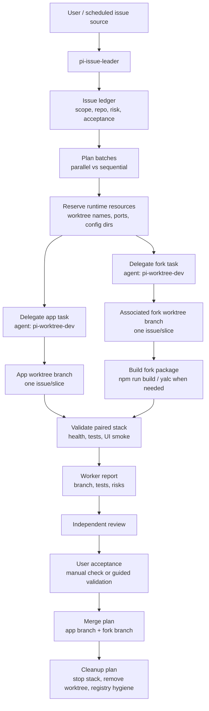

# Project Issue Orchestration Workflow

This workflow defines how the `pi-agent-chat` project handles issues through a project-scoped leader agent, isolated worktree stacks, paired fork development, PR-style branches, review, user acceptance, and cleanup.

It is intentionally project-specific. It encodes the current app repository, paired coding-agent fork, yalc/build loop, port registry, and local runtime stack rules.

## Goals

- Solve project issues without disturbing the user's active app session.
- Let one leader session coordinate many issue-solving workers.
- Run independent issues in parallel when their code paths do not conflict.
- Keep app and fork changes paired when an issue crosses repository boundaries.
- Produce one reviewable branch/PR-style deliverable per issue or coherent issue slice.
- Require explicit user acceptance before merge/cleanup decisions that could hide problems.
- Require every issue/PR-style deliverable to carry validation cases: automated tests when possible, manual acceptance cases always when user-visible behavior is affected, and evidence for what passed or remains unverified.
- Do not merge a branch just because code review passed. Merge requires review approval plus recorded validation evidence plus explicit user acceptance.

## Project Topology

| Role | Repository / worktree | Notes |
| --- | --- | --- |
| App | `/Users/xuyingzhou/.codex/worktrees/5466/pi-agent-chat` | UI, gateway, app server, scripts, docs |
| Associated fork | `/Users/xuyingzhou/.codex/worktrees/5466/pi-momo-fork` | Local fork that provides `packages/coding-agent` |
| Fork package | `packages/coding-agent` | Runtime, extensions, CLI, Agent definition parser |
| Stack registry | `~/.pi-agent-chat/worktrees/registry/` | Port and pairing records |
| Current stack | API `3102`, Vite `5175` | Current interactive stack, not a global default |

The associated fork is treated as the active development target for fork-side changes. Do not describe fork changes as PRs to an upstream project unless the user explicitly asks for that. The normal local outcome is a branch/PR-style change set against the associated fork repository.

The associated fork itself must also use worktree isolation for parallel issue work. Do not let multiple issue workers write the same shared fork checkout unless the leader explicitly assigns them to collaborate on the same branch.

## Issue And PR Lifecycle

Default order:

1. Issue or local issue ledger entry defines the problem and acceptance cases.
2. Branch/PR-style change set implements one issue or one coherent issue slice.
3. PR description or worker report links back to the issue and includes validation cases.
4. Review verifies scope, code, tests, and validation evidence.
5. User acceptance confirms the manual cases that matter for product behavior.
6. Merge closes the issue or marks the local ledger item accepted.

Do not create a new issue after every merge by default. Create a follow-up issue only when acceptance finds a gap, the PR intentionally leaves known follow-up work, a regression is discovered, or the user wants a separate tracking item. If using GitHub, prefer PR text such as `Closes #123` only after the acceptance cases are complete enough for merge.

## Agents

| Agent | Scope | Responsibility |
| --- | --- | --- |
| `pi-issue-leader` | Project | Intake issues, split work, allocate stacks/ports, delegate, track, review, plan merge and cleanup |
| `pi-worktree-dev` | Project | Implement one issue/slice in an isolated app/fork worktree stack and report back |
| `pi-expert` | Global | Framework/config/runtime expert; consulted for Pi internals and cross-repo architecture |
| `explore` | Built-in | Read-only investigation |
| `plan` | Built-in | Planning-only analysis |

## High-Level Flow



## Detailed Workflow

### 1. Intake

The leader receives one of these inputs:

- a user-described issue,
- a list of issue URLs or IDs,
- a local issue ledger,
- a future scheduled issue-polling result.

The leader creates an issue ledger with:

- issue id/title,
- priority and urgency,
- affected repository: app, associated fork, or both,
- likely conflict area,
- acceptance requirements,
- validation cases: automated, manual, visual/screenshot-assisted, and negative cases where relevant,
- required acceptance evidence: command output, browser URL, screenshot, video, log excerpt, or user confirmation,
- required tests,
- whether user validation is needed,
- target branch naming.

If issue source/polling is not configured, the leader must say so and work from the user-provided issue list.

### 2. Batch And Dependency Planning

The leader groups issues into batches:

- Parallel: unrelated UI panels, docs-only changes, independent tests, isolated backend modules.
- Sequential: shared stores, shared runtime contracts, file format migrations, app/fork protocol changes.
- Paired: any issue requiring both `pi-agent-chat` and `pi-momo-fork`.

Parallelism is allowed only after the leader checks likely overlap. If two workers will edit the same module family, the leader serializes them or makes one worker own the shared abstraction.

### 3. Resource Allocation

Before dispatch, the leader should define resource intent:

- app worktree path or branch suggestion,
- associated fork worktree path or branch suggestion,
- API and Vite port strategy,
- `PI_APP_CONFIG_DIR`,
- `PI_CLI_PATH`,
- logs/pid ownership,
- whether dependencies are linked or installed.

Port and stack information must be read from the real sources:

```text
./scripts/worktree-dev.sh list
~/.pi-agent-chat/worktrees/registry/*.env
<app-worktree>/.env
<app-worktree>/logs/dev.log
lsof -nP -iTCP:<port> -sTCP:LISTEN
```

Registry entries usually contain:

```text
APP_PATH
APP_BRANCH
API_PORT
VITE_PORT
CONFIG_DIR
AGENT_SOURCE_ROOT
AGENT_WORKTREE_PATH
AGENT_BRANCH
AGENT_CLI_PATH
AGENT_DIR
```

Default policy:

- The worker may call `scripts/worktree-dev.sh list` and `scripts/worktree-dev.sh ...` to allocate or reuse a stack.
- Ports must come from the registry/scripts, not guesses.
- Current user-facing ports such as `3100/5173` should not be reused for worker stacks.
- Shared `node_modules` is allowed only with per-worktree Vite cache isolation.

Leader allocation model:

- For small one-off tasks, the worker can allocate through scripts and report back.
- For a batch of parallel issues, the leader should first inspect the registry and assign non-overlapping app/fork worktree names, branches, and port expectations in each delegate prompt.
- The worker remains responsible for verifying the allocation against the registry and actual listeners.

### 3.1 Start A Project Stack

Workers must be able to start a project stack from the issue prompt without guessing ports, config paths, or dependency state.

Use these entry points:

```bash
# Inspect existing app/fork worktree stacks and assigned ports.
./scripts/worktree-dev.sh list

# Create a new app worktree and paired fork worktree, prepare env/registry, and start it.
./scripts/worktree-create.sh <branch-or-slug> --dev --start --with-agent-fork

# Start or repair an existing app worktree with a specific paired fork worktree.
./scripts/worktree-dev.sh <app-worktree> \
  --with-agent-fork \
  --agent-path <paired-fork-worktree> \
  --agent-branch <branch-or-slug> \
  --agent-build

# Prepare env/registry only, without starting servers.
./scripts/worktree-dev.sh <app-worktree> --no-start
```

Environment handling:

- Do not hand-copy secrets or invent a new `.env` by memory. The scripts derive the worktree `.env` from the main repo `.env`, remove stack-specific values, and rewrite `PORT`, `PI_CLI_PATH`, `PI_CODING_AGENT_DIR`, and app config paths.
- The app backend uses `PORT=<api-port>`.
- The frontend start path exports `VITE_API_TARGET=http://localhost:<api-port>`, `VITE_PORT=<vite-port>`, `VITE_AUTH_TOKEN`, and `VITE_STRICT_PORT=false`.
- `PI_APP_CONFIG_DIR` must point at the per-stack config directory under `~/.pi-agent-chat/worktrees/...`, not the main `~/.pi-agent-chat` app config.
- `PI_CLI_PATH` must point at the paired fork's `packages/coding-agent/dist/cli.js` when the issue needs fork isolation.
- `PI_CODING_AGENT_DIR` / `AGENT_DIR` should point inside the per-stack config dir so runtime-owned agent state is isolated from the user's active app session.

Dependency strategy:

- Default `--link` / `--agent-link` is acceptable for normal worktree iteration because it links existing `.yalc` and `node_modules`.
- Use `--install` when the app worktree changes package dependencies, lockfiles, postinstall output, or native dependencies.
- Use `--agent-install` when the paired fork changes its package dependencies or lockfile.
- Use `--agent-build` when fork `dist/` or extension copies must be refreshed before spawning the CLI.
- Shared dependencies are acceptable only if Vite cache isolation remains in place; if React hook errors or duplicate React symptoms appear, verify `vite.config.ts` cache and `resolve.dedupe` first.

Start verification:

```bash
./scripts/worktree-dev.sh list
curl -sS http://localhost:<api-port>/health
rg "PORT=|PI_CLI_PATH|PI_APP_CONFIG_DIR|VITE_API_TARGET" <app-worktree>/logs/dev.log <app-worktree>/.env
```

Every worker report must include:

- app worktree path and branch,
- paired fork worktree path and branch, if any,
- API port, Vite port, `PI_APP_CONFIG_DIR`, `AGENT_DIR`, and `PI_CLI_PATH`,
- app dependency strategy and fork dependency strategy,
- whether yalc was needed,
- whether existing app/Agent sessions need reload or restart.

### 3.2 Paired Fork Worktree And yalc

When an issue touches the associated fork:

1. Create or reuse a paired fork worktree for that issue.
2. Point the app stack at that fork worktree with `PI_CLI_PATH=<paired-fork>/packages/coding-agent/dist/cli.js`.
3. Edit fork source in the paired fork worktree, not in app `node_modules`, app `.yalc`, or a shared fork checkout.
4. Build fork output:

```bash
npm --prefix <paired-fork>/packages/coding-agent run build
```

5. If app code imports changed package APIs/types, update the app consumer package path. For the current yalc workflow, the common command is:

```bash
cd <paired-fork>/packages/coding-agent
yalc push
```

6. Restart/reload affected app/Agent sessions so existing processes load new `dist` and extension copies.

Important nuance: `PI_CLI_PATH` covers spawned CLI runtime. yalc covers app-side package imports/types. Some fork changes need only `PI_CLI_PATH + build`; shared API/type changes may also need yalc/app reinstall handling.

### 4. Validation Case Contract

Every issue/PR-style deliverable needs a validation packet before it can be reviewed or merged.

Minimum validation packet:

- **Problem statement**: what user problem or regression this fixes.
- **Automated test cases**: exact commands, expected result, and actual result. If no automated test is practical, say why.
- **Manual acceptance cases**: step-by-step user-facing cases with setup, actions, expected result, and pass/fail status.
- **Evidence**: browser URL, API port, screenshot/video path, log excerpt, command output, or explicit user confirmation.
- **Negative or edge cases**: at least one "should not happen" case for risky UI/runtime changes, such as refresh/reconnect, missing config, empty state, or disabled provider.
- **Residual risk**: what remains untested and why.

Manual acceptance cases are required when the change affects:

- visible UI, interaction, layout, responsive behavior, accessibility, copy, or loading/error/empty states,
- runtime startup, worktree stack, env, yalc/fork behavior, ports, or config isolation,
- file input, preview, image/OCR/video/PDF/binary handling,
- model/provider/proxy/auth/Bridge behavior,
- session, delegate, review, approval, notification, or reconnect behavior.

Manual cases should be concrete enough that the user can run them without reading the code. Prefer this shape:

```text
Manual Case: <name>
Setup:
- <exact URL/branch/worktree/config>
Steps:
1. <action>
2. <action>
Expected:
- <observable result>
Evidence:
- <screenshot/log/user confirmation>
Status:
- pending | passed | failed | blocked
```

Visual/screenshot-assisted validation is allowed, but it does not replace user acceptance for product behavior unless the user explicitly delegates that decision. If an Agent uses screenshots or browser automation, the report must include what was inspected and what could not be judged automatically.

Merge gate:

- `Review passed` is not enough.
- `Automated tests passed` is not enough.
- A merge is allowed only after the validation packet is present, the required manual acceptance cases are passed or explicitly waived by the user, and the user or designated acceptance owner records an acceptance decision.

### 5. Delegation

The leader delegates implementation to `pi-worktree-dev`.

Every delegate prompt must include:

- issue id/title,
- target repository or repositories,
- branch suggestion,
- worktree/port/config expectations,
- paired fork worktree expectation when fork work is possible,
- yalc/build expectation when fork output or package API changes,
- required docs to read,
- acceptance checklist,
- validation cases expected from the worker,
- evidence expected for user acceptance,
- required tests,
- PR target wording,
- report-back format.

For fork-side work, say "associated fork branch/PR-style change set", not "upstream PR", unless explicitly requested.

### 6. Worker Execution

`pi-worktree-dev` handles implementation:

1. Check `git status --short` in every target repository.
2. Read `AGENTS.md` and this workflow.
3. Prepare or verify isolated app + paired fork stack.
4. Implement narrowly.
5. For fork changes:
   - edit fork source, not app `node_modules` or generated `.yalc` directly,
   - run `npm run build` in `packages/coding-agent`,
   - run `yalc push` only when the app consumer must use updated fork output,
   - report whether existing sessions need reload/restart.
6. Validate from runtime outward:
   - core/RPC or package tests,
   - app build or targeted tests,
   - stack health,
   - browser/UI smoke if relevant.
7. Produce or update the validation packet with automated tests, manual acceptance cases, evidence, and residual risk.
8. Report to the leader with branch, changes, tests, validation cases, evidence, and risks.

### 7. Review

Review is a separate task, not the same worker casually approving itself.

Review checks:

- issue requirements,
- affected repo boundary,
- branch/worktree hygiene,
- tests and evidence,
- validation packet completeness,
- manual acceptance case quality,
- user-visible behavior,
- docs/AGENTS updates,
- app/fork protocol compatibility,
- whether PR target is correct.

Review outcome is one of:

- `approved-for-user-acceptance`,
- `needs-worker-fix`,
- `needs-validation-case`,
- `blocked-by-decision`,
- `not-scope-safe`.

### 8. User Acceptance

This is intentionally not fully automated yet.

Default policy:

- After Review, the leader asks the user to validate meaningful product behavior.
- For UI changes, provide the exact Vite URL and detailed manual acceptance cases.
- For runtime/fork changes, provide exact commands, expected behavior, and recovery/fallback cases.
- For screenshot-assisted checks, include the screenshot or browser evidence and still mark the user-facing acceptance decision as `pending` until the user accepts or explicitly waives it.
- User acceptance status is one of `accepted`, `rejected`, `accepted-with-follow-up`, or `waived-by-user`.
- If the user wants an acceptance Agent later, create a separate project Agent that collaborates with the user and records acceptance evidence.

Open decision: whether acceptance should be a human-only step, a guided user+Agent step, or a dedicated `pi-acceptance-reviewer` agent.

### 9. Merge And Cleanup

The leader does not merge or delete worktrees by default.

Before merge/cleanup:

- all workers reported done,
- independent review passed,
- validation packet is complete,
- required automated tests passed or were explicitly waived with reason,
- required manual acceptance cases passed or were explicitly waived by the user,
- user acceptance decision is recorded,
- app/fork branch pairing is clear,
- dirty worktrees are listed,
- cleanup target registry entries are listed.

Cleanup may include:

- stop dev server,
- merge branches,
- remove worktrees,
- prune stale registry entries,
- remove logs/pids only for the owned stack.

## Delegate Prompt Template

```text
【Issue】<id/title>
【Goal】<concrete result>
【Target repos】app | associated-fork | both
【Branch suggestion】codex/<issue-slug>
【PR target】current associated project/fork branch, not upstream unless explicitly requested
【Workflow】Read docs/workflows/project-issue-orchestration.md and docs/workflows/local-paired-worktree-stack.md
【Resource plan】
- app worktree: <path or let scripts allocate>
- associated fork worktree: <path or not needed>
- ports/config: use ./scripts/worktree-dev.sh list + registry; do not guess
- yalc/build: specify whether PI_CLI_PATH build is enough or yalc push is required
【Acceptance】
- Problem: <user-visible problem or regression>
- Automated cases:
  - <command>: <expected result>
- Manual cases:
  - Case: <name>
    Setup: <URL/config/worktree>
    Steps: <numbered user actions>
    Expected: <observable result>
    Evidence: <screenshot/log/user confirmation>
- Negative/edge cases:
  - <case>
- Merge gate: do not merge until manual acceptance is passed or explicitly waived by the user
【Report back】
- branch/worktree
- changed files
- tests
- validation packet and evidence
- risk/unknowns
- ready for review? yes/no
```

## Open Decisions

These are intentionally unresolved until the user chooses a policy:

- Issue source: GitHub issue polling, local markdown ledger, app UI queue, or manual user input.
- Polling cadence: manual, scheduled, or leader-initiated only.
- Port allocation owner: leader pre-allocates all ports, or worker allocates through scripts and reports back.
- PR target: local branch only, GitHub PR in associated fork, or GitHub PR to upstream.
- Acceptance owner: user only, leader-guided user acceptance, or a dedicated acceptance Agent.
- Auto-merge: never by default; can be enabled later with explicit policy and safeguards.
